# แนะนำ ionic creator 

ionic creator สามารถสร้างเว็บ web app จบได้บนเว็บไซต์ที่เดียว

มีความสามารถแสดงผลได้หลาย patform สามารถเลือกรุ่นมือถือที่จะแสดงผลได้ 

ไม่ต้องแยกทีมพัฒนา สามารถทำครั้งเดียวรองรับ Device ทั้ง IOS และ Android 

ใช้งานง่าย ไม่ต้องเขียน code เพียงแค่ลากวางเท่านั้น และจำลองการทำงานเสมือนจริง สร้าง Link ไปหน้าต่างๆได้ทันที 

มีเครื่องมือพื้นฐานให้เลือกใช้ค่อนข้างครบ ง่ายต่อการปรับแต่ง มีความยืดหยุ่นสูง 
___

<a class="improve-v2-docs" href=' https://creator.ionic.io'>ขั้นตอนการสมัคร เข้าไปที่  https://creator.ionic.io</a>
### การสมัครสมาชิก

หากยังไม่มี Account ให้เลือก Get started  

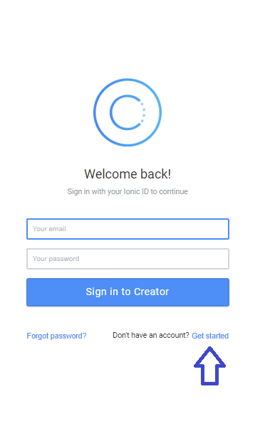
___

กรอกชื่อ email ,passwaord เพื่อยืนยันการสมัคร 
  
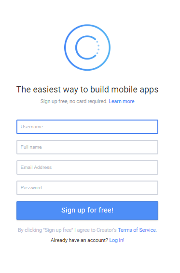
___

เมื่อสมัครแล้ว จะเข้ามาหน้า Dashboard เริ่มสร้าง Project
ให้คลิกที่ New project

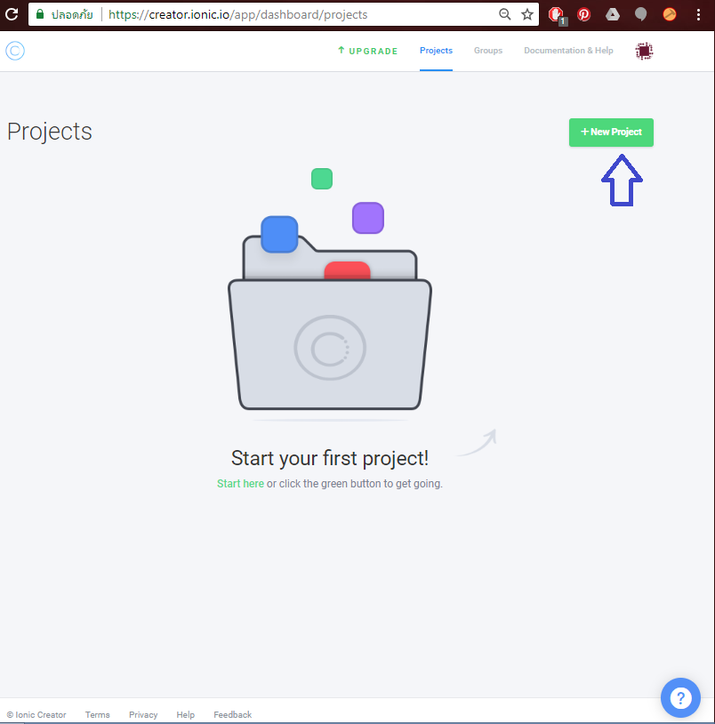
___

เพิ่มชื่อ Project 

ส่วน Choose a project type :  เลือกแบบ Blank จะง่ายต่อการปรับแต่ง 

เมนูด้านข้างเลือก Ionic 3.2.0 reator ALPHA เพราะเครื่องมือจะมีเยอะกว่า 

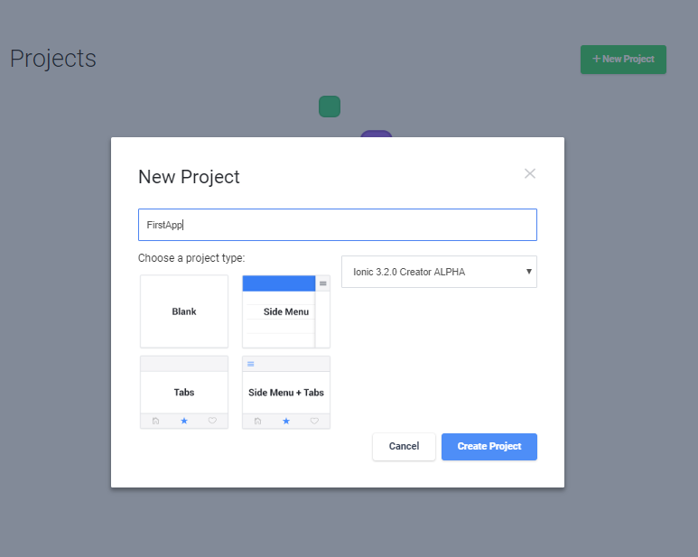
กด Create Project
___
 

จะมีข้อความแจ้งว่ามีอะไรใหม่ หรือมีอะไรให้ปรับปรุง กด Ok ข้ามไป  

หน้าต่างการทำงานหลัก จะแบ่งเป็น 3 ส่วน

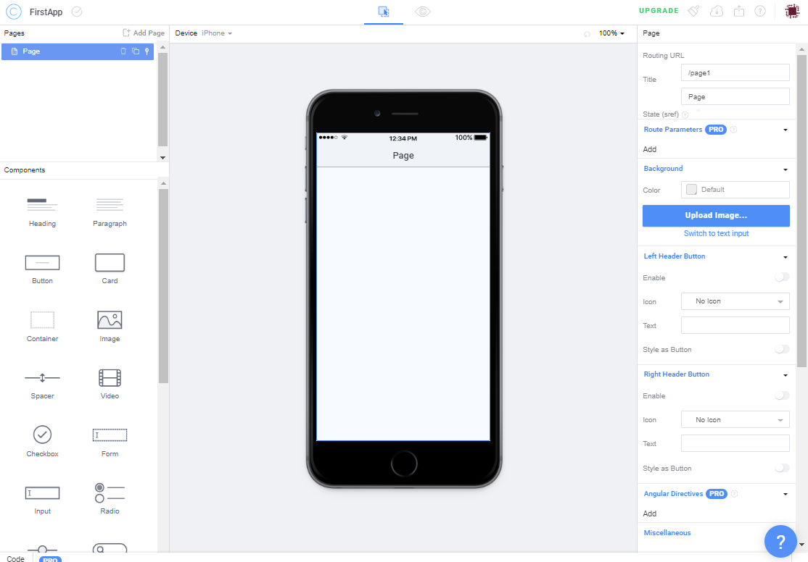

ด้านซ้าย : คือส่วนที่เป็น Page และ Componants   
___
Page คือส่วนแสดงภาพรวมหน้าทุกหน้า ว่ามี Componants อะไรอยู่ในหน้านั้นบ้าง และใช้จัดการหน้าของ App ทั้งหมด 

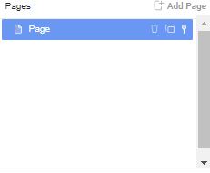

Componants  คือส่วนประกอบที่เราจะเลือกใช้งาน โดยการลากไปวางในรูป Mobile ตรงกลาง ว่าให้ App เรามีส่วนประกอบอะไรบ้าง 

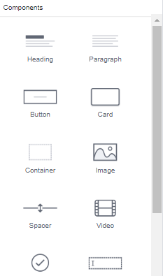
___

เราสามารถเลือกของมาวางในแต่ละหน้าให้ใกล้เคียงกับที่ออกแบบใว้  

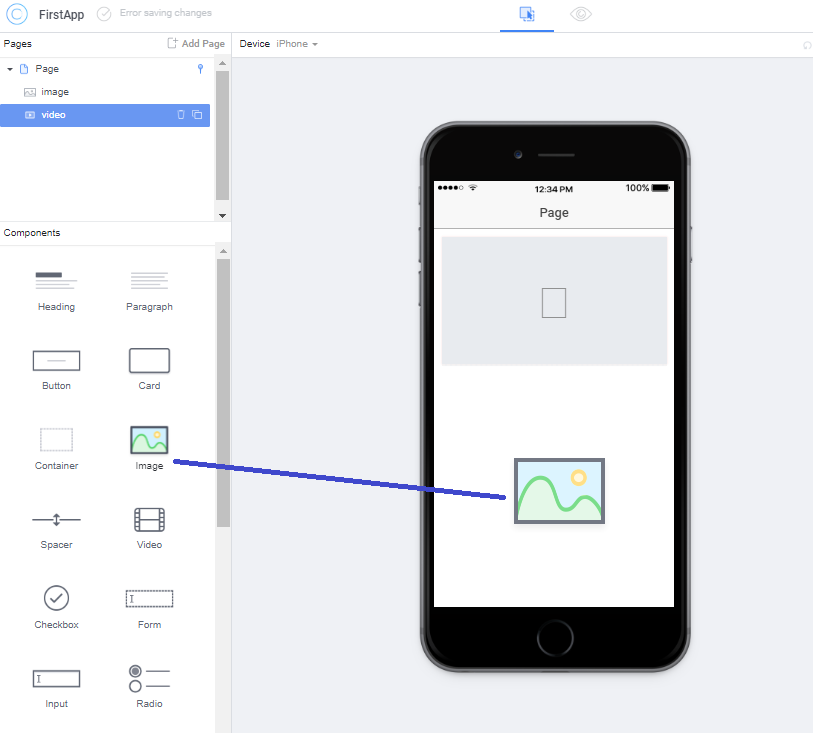
___

มุมซ้ายบนจะมี dropdown ให้เลือกรุ่น Mobile ว่าเป็น IOS หรือ Android ก็ได้

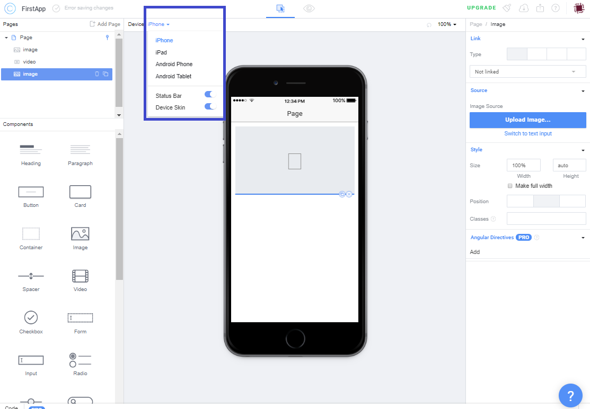
___

ส่วนด้านขวา : ส่วนปรับแต่ง ของแต่ละ Componant 
เมื่อคลิกเลือกวัตถุใด ที่เราลากมาวางในโมบายแล้ว จะมีส่วนปรับแต่งรายละเอียดแต่ละชิ้น

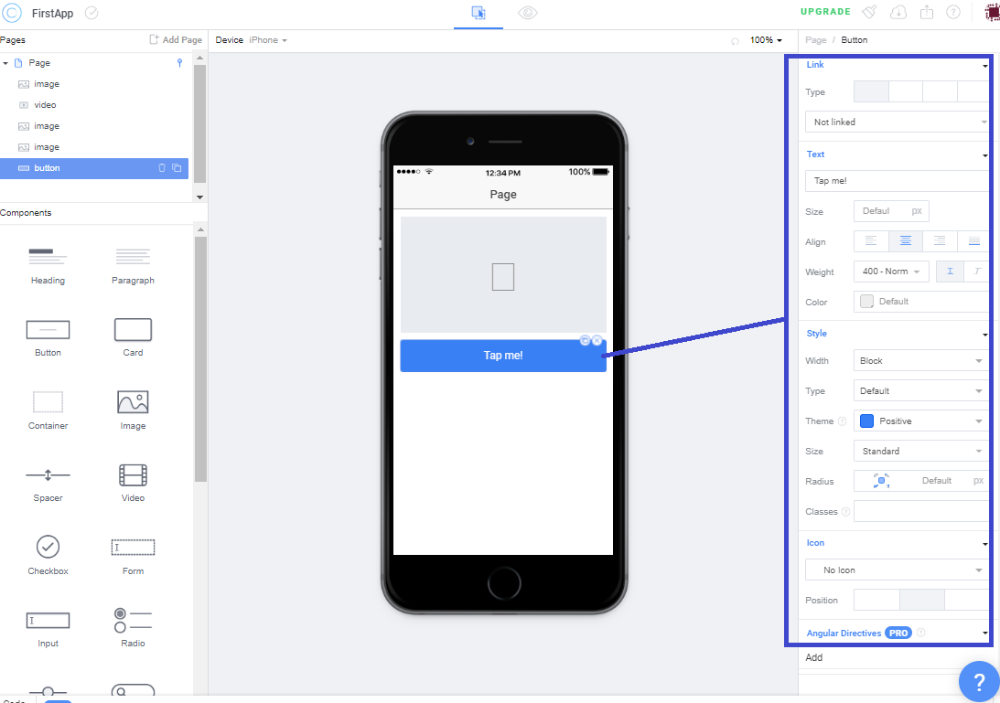
___

เราจะสลับมุมมองการทำงานจริงโดยกด icon รูปตาด้านบนโมบาย เพื่อดูว่าตัว App จริงจะหน้าตาเป็นยังไง และสามารถจำลองการทำงานจริงได้เลย

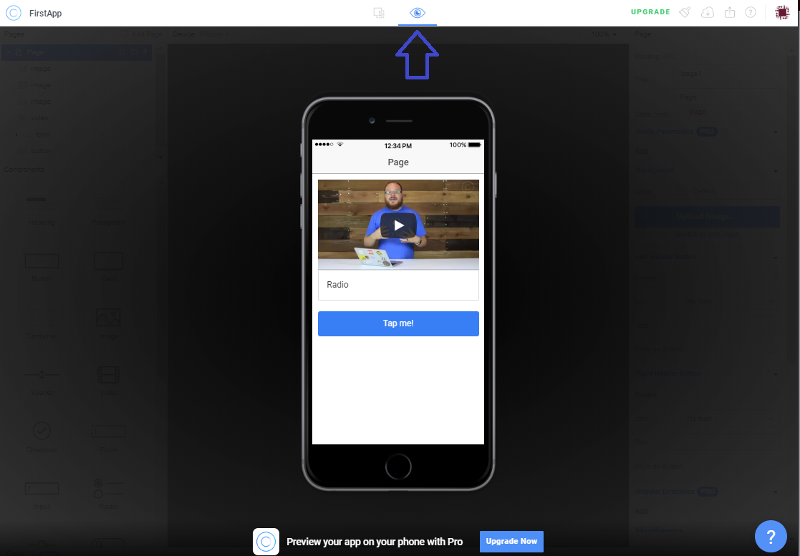
___

นี่คือหน้าตาของ ionic creator คร่าวๆ 
หากต้องการดู VDO การทำงานจริงๆ ดูตามวิดีโอที่นี่

 
### <a class="improve-v2-docs" href='https://youtu.be/S4rTmzAyd5s'>VDO Link : </a>
<a href="https://youtu.be/S4rTmzAyd5s" target="_blank">
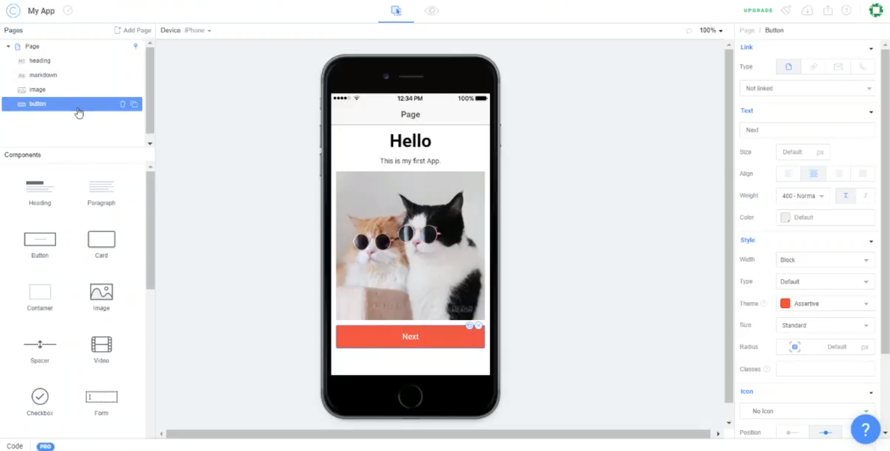