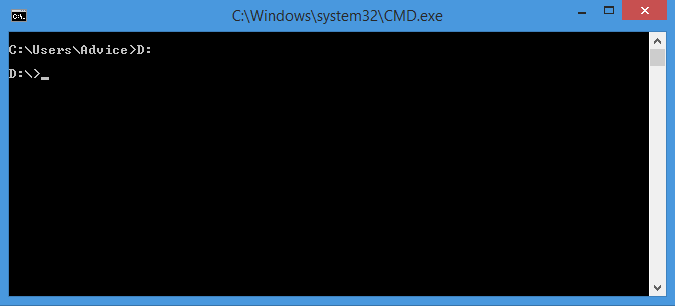

# EP 02-02 Basic Command Prompt

### CMD คืออะไร

CMD คือ คำสั่งที่ใช้เปิด Windows Command interpreter สามารถเรียกใช้โปรแกรมต่าง ๆ ผ่าน text mode ปกติเวลาเราใช้งานวินโดวส์มักจะใช้งานอยู่ในโหมดของกราฟฟิคโหมด (GUI ) ซึ่งระบบ GUI นี้ทำให้เราสามารถทำงานทุกๆอย่างไม่ว่าจะเป็น การสั่งรันโปรแกรม ก็อปปี้ไฟล์หรือลบไฟล์ ผ่านทางวินโดวส์โหมดได้ แต่ระบบปฏิบัติการก็มีโหมดที่เรียกว่า "Command Prompt" หรือบางทีก็เรียกว่า "Dos Prompt" ซึ่งเป็นโหมดการทำงานในสภาพแวดล้อมที่เป็นตัวอักขระ (Text Mode) นั่นหมายความว่าเมื่อต้องการใช้คำสั่งใด ท่านต้องพิมพ์คำสั่งต่างๆเอาเอง ซึ่งจะพบเห็นได้ในโปรแกรมเก่าๆหลายตัว หรือแม้แต่โปรแกรมใหญ่ๆบางตัว จะเรียกใช้งานหรือปรับแต่งค่าได้เมื่ออยู่ในโหมด Command Prompt เท่านั้น

Credit : [http://www.mindphp.com](http://www.mindphp.com)

* * *

### การเข้าใช้งานโหมด Command Prompt

1) ทำการเปิดหน้าต่าง Run โดยคลิกที่ปุ่ม Start > Run  (หรือจะใช้คีย์ลัด Windows + R) แล้ว  พิมพ์คำสั่ง CMD  

2) กด OK ก็จะเข้าสู่โหมด Command Prompt พร้อมใช้งาน   

* * *

### คำสั่งพื้นฐาน

1) DIR (Directory)  
ถ้าเราต้องการดูว่าใน Folder ปัจจุบันที่เราอยู่มี Folder หรือ File อะไรอยู่ข้างในบ้าง 
   
* พิมพ์คำสั่ง 

    A>  dir 

* * *

* เมื่อกด Enter จะแสดงข้อมูล Folder และ File ต่างๆ ที่มีอยู่ใน Folder (ที่เราอยู่)

* * *

2) CD (Change Directory)  
ถ้าเราต้องการไปยัง Folder ที่เราต้องการ เช่น ต้องการไปที่ Folder Desktop

* พิมพ์คำสั่ง  

    A>  cd [ชื่อ Folder] 

* * *

* เมื่อกด Enter เราก็จะไปอยู่ ณ Folder ที่เราต้องการ

  
  และถ้าเราต้องการกลับมายัง Folder ก่อนหน้า

* พิมพ์คำสั่ง  

    A>  cd ..

* * *

* เมื่อกด Enter เราก็จะกลับมาอยู่ ณ Folder ก่อนหน้า

* * *

3) CLS (Clear Screen)  
เมื่อเรารู้สึกว่าหน้าต่างเริ่มรก เราสามารถล้าง(Clear) หน้าต่างได้

* พิมพ์คำสั่ง  

A>cls

* * *

* เมื่อกด Enter หน้าต่างก็จะถูกล้าง(Clear)

* * *

4) เปลี่ยน Drive (ไปยัง Drive D หรือ Drive ที่มีในเครื่อง)  
ถ้าเราต้องการไปยัง Drive ที่เราต้องการ เช่น ต้องการไปที่ Drive D

 * พิมพ์คำสั่ง

    A>  D:

* * *

* เมื่อกด Enter เราก็จะไปอยู่ ณ Folder ที่เราต้องการ

   
   และถ้าเราต้องการรู้ว่าข้างในมีอะไรบ้างก็สามารถใช้คำสั่ง dir เพื่อดูข้อมูลได้เช่นกัน

* * *

5) MD (Make Directory)  
หากเราต้องการสร้าง Folder ก็สามารถทำได้ เช่น ต้องการสร้าง Folder BBB

* พิมพ์คำสั่ง  

    A>  md [ชื่อ Folder]

* * *

* เมื่อกด Enter แล้ว Folder ก็จะถูกสร้าง

* * *

* สามารถใช้คำสั่ง dir เพื่อดูการเปลี่ยนแปลงได้

  

เห็นได้ว่า Folder BBB ได้ถูกสร้างขึ้นมาแล้ว

* * *

6) RD (Remove Directory)  
หากเราต้องการลบ Folder ก็สามารถทำได้ เช่น ต้องการลบ Folder AAA

* พิมพ์คำสั่ง  
    
    A>  rd [ชื่อ Folder]
    

 * เมื่อกด Enter แล้ว Folder ก็จะถูกลบ

 * สามารถใช้คำสั่ง dir เพื่อดูการเปลี่ยนแปลงได้

  

เห็นได้ว่า Folder AAA ได้ถูกลบไปแล้ว  

* * *

[VDO Link : ](http://www.youtube.com/watch?v=276yxgySH6k)

