# ติดตั้ง Visual Studio Code

### Download ตัวติดตั้ง Visual Studio Code

1. ค้นหา Visual Studio Code หรือ VS Code จาก Google หรือ เข้าที่ Link: https://code.visualstudio.com/  
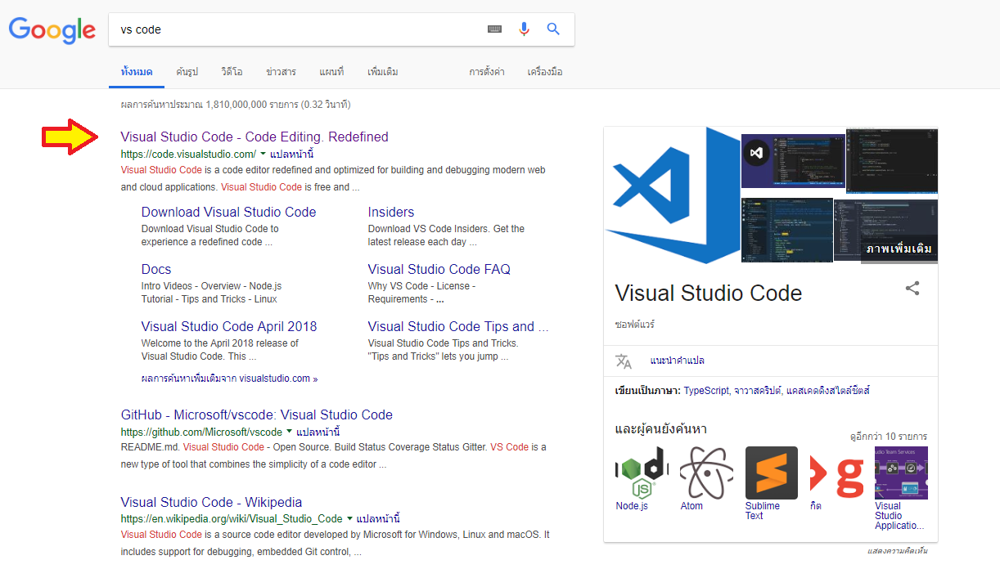

2. คลิกที่ Download for Windows เพื่อ download ตัวติดตั้ง  
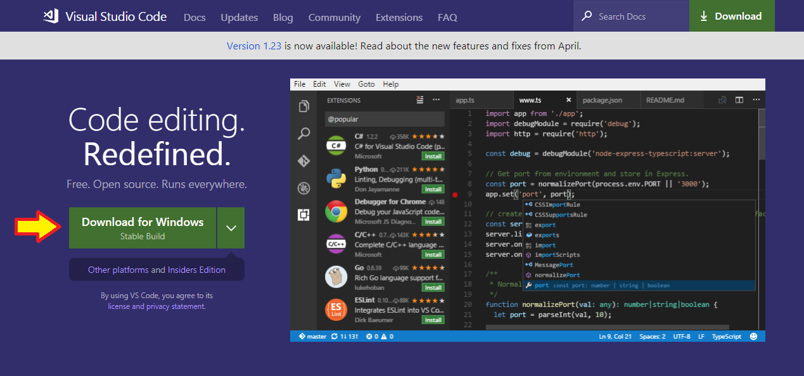

3. Download เสร็จแล้วกดติดตั้งได้เลย  
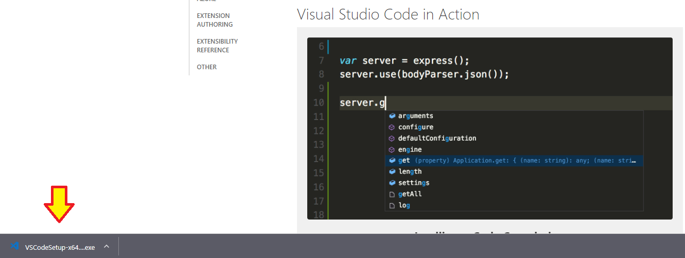
---

### ขั้นตอนการติดตั้ง Visual Studio Code

1. เปิดไฟล์ VSCodeSetup-x64-1.23.1.exe ที่ Download มา แล้วคลิก Next
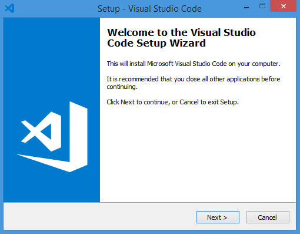

2. คลิกที่ช่อง I accept the agreement แล้วคลิก Next  
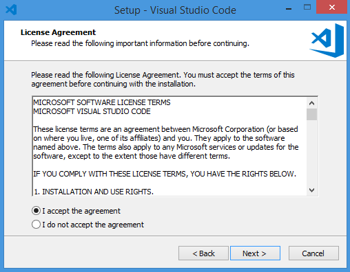

3. เลือกตำแหน่งของ Folder ที่ต้องการติดตั้ง แล้วคลิก Next  
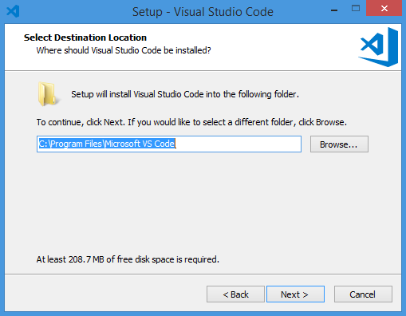

4. หากไม่ต้องการให้สร้างบน Start Menu ให้คลิกที่ช่อง Don't create a Start Menu folder แล้วคลิก Next  
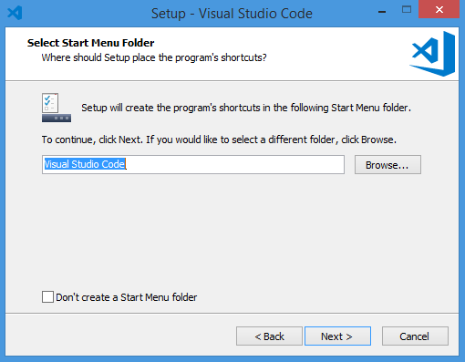

5. ให้คลิกทุกช่อง แล้วคลิก Next  
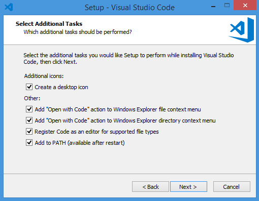

6. คลิก Install  

7. รอ Download จนเสร็จ  
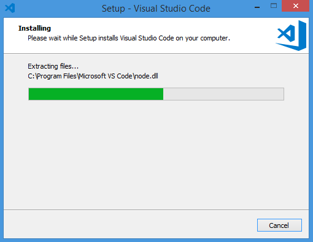

8. ติดตั้งเสร็จเรียบร้อยแล้ว กด Finish  
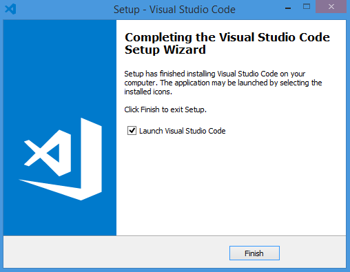

9. หน้าต่างของ Visual Studio Code ที่ได้ทำการติดตั้งเรียบร้อยแล้ว  
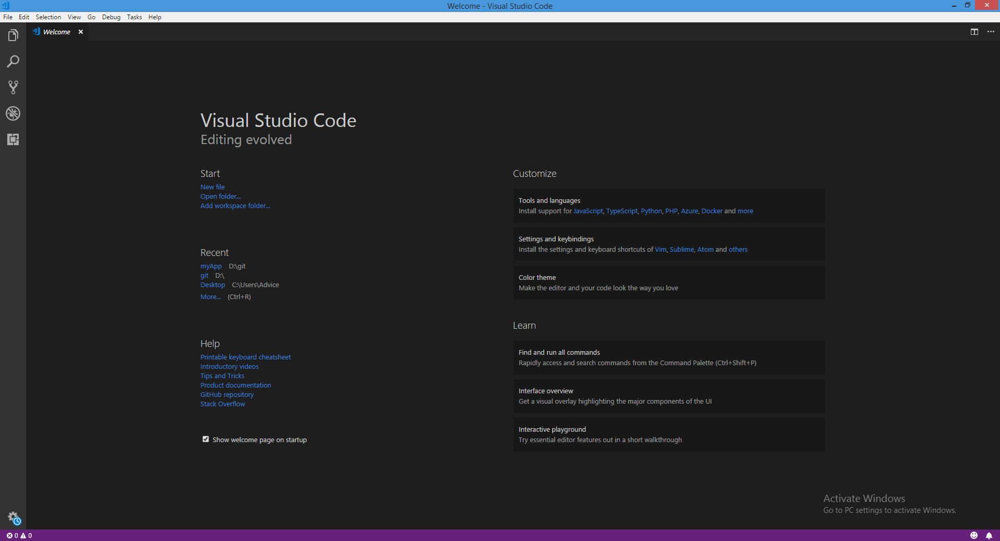
---

### VDO Link :  

