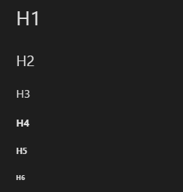
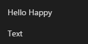
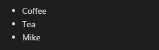

# EP 03-01 HTML (Hypertext Markup Language)

HTML คือภาษาหลักที่ใช้ในการเขียนเว็บเพจ โดยใช้ Tag ในการกำหนดการแสดงผล
ประกอบด้วย Tag เปิด <> และ Tag ปิด </> 

ตัวอย่างการสร้างหัวข้อขนาดต่างๆ

{line-numbers=off} 
~~~~~~~~ 
 <h1>H1</h1>
 <h2>H2</h2>
 <h3>H3</h3>
 <h4>H4</h4>
 <h5>H5</h5>
 <h6>H6</h6>
~~~~~~~~ 

จะแสดงข้อความแบบHeader (หัวข้อ)

* * *

แบบข้อความธรรมดา

{line-numbers=off} 
~~~~~~~~ 
<label>Hello</label>
Happy

Text

~~~~~~~~ 

จะแสดงข้อความแบบธรรมดา

* * *

แบบ List (รายการ)

{line-numbers=off} 
~~~~~~~~ 
<ul>
    <li>Coffee</li>
    <li>Tea</li>
    <li>Mike</li>
</ul>  
~~~~~~~~   

* * *

ใส่รูปภาพ

{line-numbers=off} 
~~~~~~~~ 
 
~~~~~~~~   

urlimage คือที่อยู่ของรูปภาพ สามารถดึงมาจากภายนอกได้

แสดงรูปภาพสามารถกำหนดขนาดรูปภาพได้ตามที่ต้องการ

A>หมายเหตุ : Save ไฟล์ เป็นนามสกุลhtml (.html) เท่านั้นในการเขียน html

ทั้งนี้เป็นหลักการเบื้องต้น เพื่อแสดงให้เห็นคำสั่งแบบภาพรวมของ html เท่านั้น หากท่านสนใจสามารถเรียนเพิ่มเติมได้จากบทเรียนที่ต่างๆ

