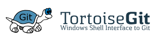

# EP 04-01 Git

#### ทำไมต้องใช้ Git

ปัญหาที่เกิดขึ้นบ่อยๆ เมื่อเราต้องแก้งานหลายๆครั้ง

* หา project ที่เรา backup ไว้ไม่เจอ 

* ลบโค๊ด หรือทำโค๊ดหาย แต่ไม่ทราบว่าเก็บใว้ที่ใหน 

* ปัญหา Hard Disk เต็ม จากการ backup project

* ต้องเซฟงานใส่ Flash Drive ส่งให้ทีม

* เมื่อแบ่งงานกับเป็นทีม ยากต่อการแจกจ่ายงาน

* หากงานที่เราทำเป็น Production ใช้งานไปแล้ว แต่เราอยากพัฒนาโดยไม่กระทบกับ Production หลัก

#### Git คืออะไร 

Git คือ Version Control ตัวหนึ่ง ที่สร้างมาเพื่อจัดการกับปัญหาข้างต้น ซึ่งเป็นระบบที่มีหน้าที่ในการจัดเก็บการเปลี่ยนแปลงของไฟล์ในโปรเจ็คเรา มีการ backup code ให้เรา สามารถที่จะเรียกดูหรือย้อนกลับไปดูเวอร์ชั่นต่างๆของโปรเจ็คช่วงเวลาใดก็ได้ สามารถระบุได้ว่าไฟล์นั้นๆใครเป็นคนเพิ่มหรือแก้ไข 
Version Control เหมาะสำหรับนักพัฒนา  และจะมีประสิทธิภาพมากหากนำมาใช้กับการทำงานเป็นทีม

#### เริ่มต้นติดตั้ง Git

download tortoisegit จาก

[tortoisegit](https://tortoisegit.org/download/)  

* ติดตั้ง Git for Windows

เมื่อติดตั้ง tortoisegit เรียบร้อยแล้ว ถ้าเราคลิกขวาในโฟลเดอร์ จะมีเมนูคำสั่งเพิ่มขึ้นมา ให้เราคลิก Git clone  windows จะเด้งหน้า pop up ขึ้นว่ามาเราต้องติดตั้ง Git for windows ก่อน ให้เราคลิกที่ปุ่ม open git for windows web site ทำการดาวโหลด Git for windows แล้วทำการติดตั้งให้เรียนร้อย

### Server สำหรับให้บริการ Git (Version Control Repository Hosting Service)

ในกรณีเริ่มต้น แนะนำให้ใช้ Server ที่ให้บริการ Git แค่สมัครก็เข้าไปใช้งานได้เลย โดยเว็ปไซต์ยอดนิยมจะมีดังนี้

[Github](https://github.com/)  
[Bitbucket](https://bitbucket.org/product)  
[Gitlab](https://about.gitlab.com/)

ซึ่งเว็ปเหล่านี้จะมีให้บริการทั้งแบบ Public (เปิดสาธารณะ) และ Private (เฉพาะคนที่เราอนุญาตเท่านั้น) แต่ถ้าต้องการทำเป็น Open Source ขอแนะนำ GitHub 

### Git Clone 

ในกรณีที่เราไปเจอโปรเจ็คที่น่าสนใจ เราสามารถที่จะเซฟมาลงเครื่องของเราได้เลย เราเรียกการทำแบบนี้ว่าการ clone เหมือนกับการกดดาวน์โหลดโปรเจ็คมาใว้ใช้ หรือแก้ไขในเครื่อง

### git commit  

เวลาที่มีข้อมูลที่แก้ไขเสร็จแล้ว (โค้ดที่เขียนคำสั่งบางอย่างเสร็จแล้ว) แล้วอยากจะทำการ Backup เก็บไว้ใน VCS จะเรียกกันว่า Commit ครับ  

ซึ่งการ Commit จะสามารถเลือกได้ว่าจะเอาไฟล์ไหนบ้าง (ไม่จำเป็นต้องเลือกทุกไฟล์)  
การ Commit ก็คือ ในแต่ละครั้งที่ทำการ Commit มันจะจำแค่ว่ามีตรงไหนของข้อมูลที่ถูกเปลี่ยนแปลงไปเรื่อยๆ ดังนั้นในแต่ละ Commit จะไม่มีไฟล์ข้อมูลฉบับเต็ม แต่สามารถย้อนดู History ได้ว่ามีการแก้ไขอะไรบ้าง ทำให้รู้ว่าใน Commit นั้นๆ แต่ละไฟล์มีข้อมูลเป็นอย่างไร 

และในการ Commit แต่ละครั้ง จะต้องใส่ Commit Message ด้วย เพื่ออธิบายรายละเอียดของข้อมูลใน Commit นั้นๆว่าเราทำอะไรไปบ้าง เพื่อที่มาดูในภายหลังจะได้อ่านจาก Commit Message ได้เลย การ Commit ที่ดีจึงควรใส่ใจกับ Commit Message ด้วย

เลือกไฟล์  
ใส่ massage ว่าทำอะไร  
ใส่ชื่อว่าใครเป็นคนแก้ไฟล์

### Git Push

เวลาที่มี Commit อยู่ในเครื่องและต้องการจะ Sync ขึ้นไปเก็บไว้ใน Remote จะเรียกขั้นตอนนี้ว่า Push  

ใส่ชื่อ accout github และ password
ส่งโค๊ดจาก local ไปที่ Github  

### Git Pull  

git pull ก็คือการรวมโค๊ดจาก remote มายัง local โดยที่เราไม่สามารถรู้ได้เลยว่าจะรวมโค๊ดอะไรบ้าง แต่จะสามารถดูได้หลังจาก pull เสร็จแล้ว