# ติดตั้ง Dotnet core CLI

### Download ตัวติดตั้ง Dotnet core CLI

1. ค้นหา dotnet core จาก Google หรือ เข้าที่ Link: https://www.microsoft.com/net/download/windows 

2. Download .NET Core SDK 2.1.200 (x64 หรือ x86 แล้วแต่เครื่อง)
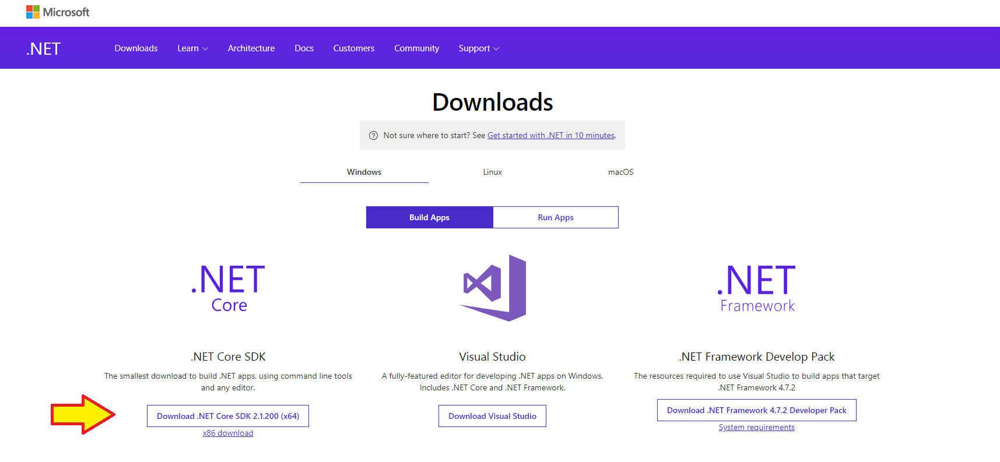

3. Download เสร็จแล้วกดติดตั้งได้เลย
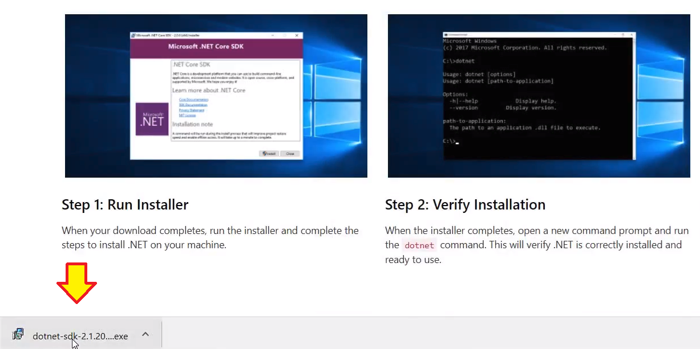
---

### ขั้นตอนการติดตั้ง Dotnet core CLI

1. เปิดไฟล์ dotnet-sdk-2.1.20-win-x64.exe ที่ Download มา แล้วคลิก install  
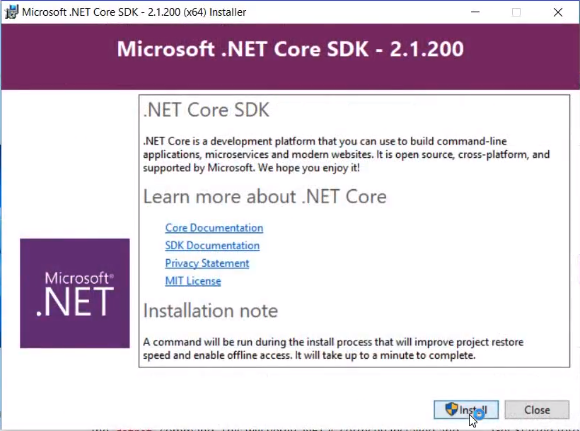

2. รอให้โปรแกรมทำการติดตั้ง  
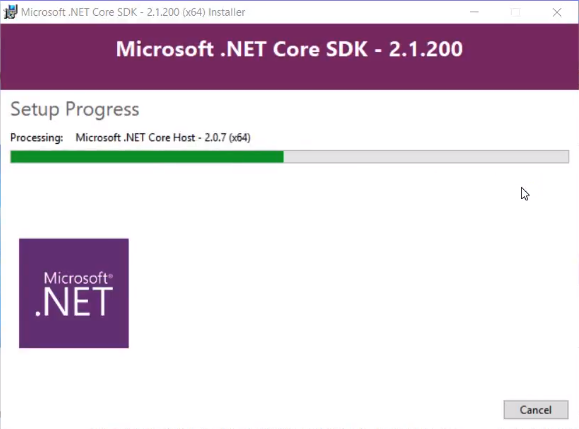

3. ติดตั้งเสร็จเรียบร้อยแล้ว กด Close เพื่อปิดตัวติดตั้งได้เลย  
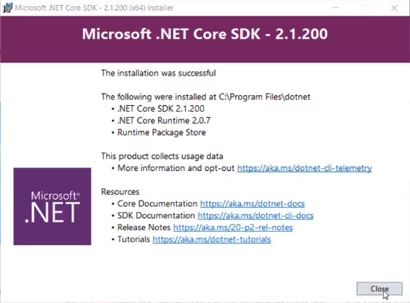
---

### ตรวจสอบว่าโปรแกรมได้ทำการติดตั้งแล้ว

1. เปิดหน้าต่าง Command prompt โดยเข้าไปที่หน้าต่าง Run (start->run หรือ windows+R) แล้วพิมพ์คำสั่ง cmd  
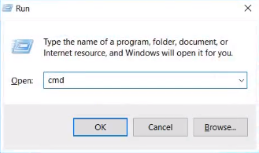

2. เมื่อเปิดหน้าต่าง Command prompt แล้ว พิมพ์คำสั่ง dotnet แล้วกด Enter  
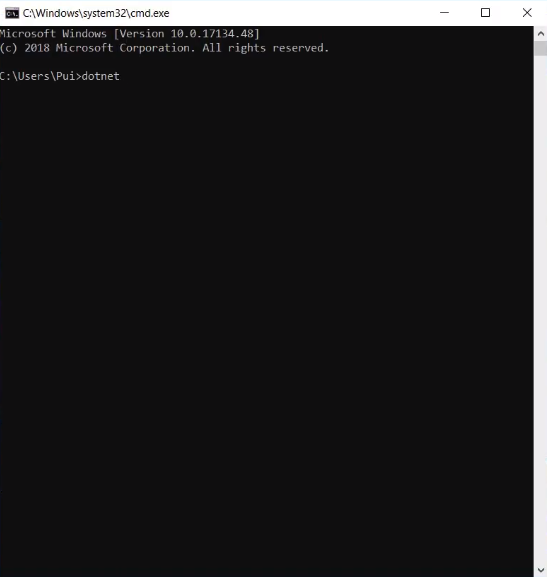

3. ถ้าแสดงข้อมูลแบบนี้ แสดงว่าติดตั้งเรียบร้อยแล้ว  
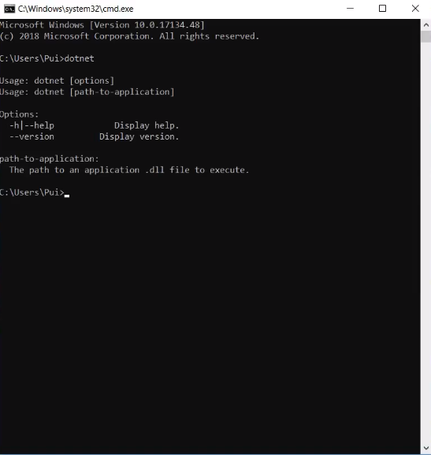

4. สามารถใช้คำสั่งต่างๆ ของ dotnet ได้ เช่น พิมพ์คำสั่ง dotnet --version แล้วกด Enter  
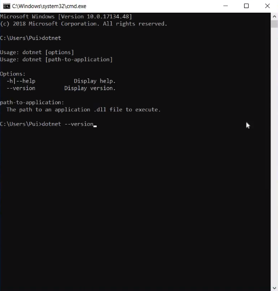

5. จะแสดงข้อมูล version ของ Dotnet core CLI ที่ได้ติดตั้งบนเครื่อง  

6. สามารถใช้คำสั่ง dotnet -h หรือ --help เพื่อเปิดหน้าต่าง Display help  
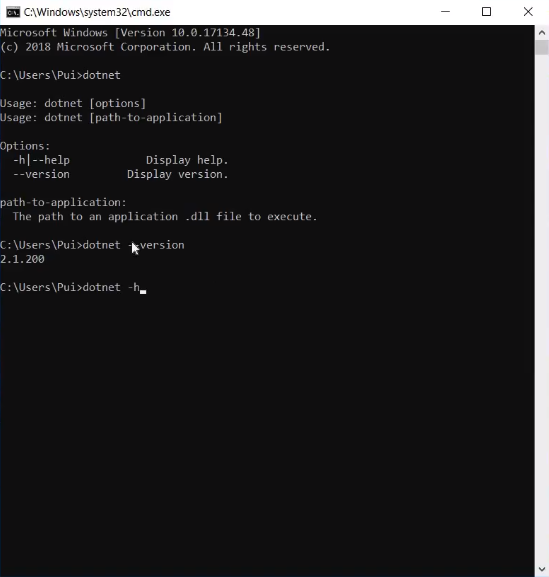

7. เมื่อกด Enter จะแสดงข้อมูลคำสั่งต่างๆ ของ Dotnet core CLI ให้เลือกใช้  
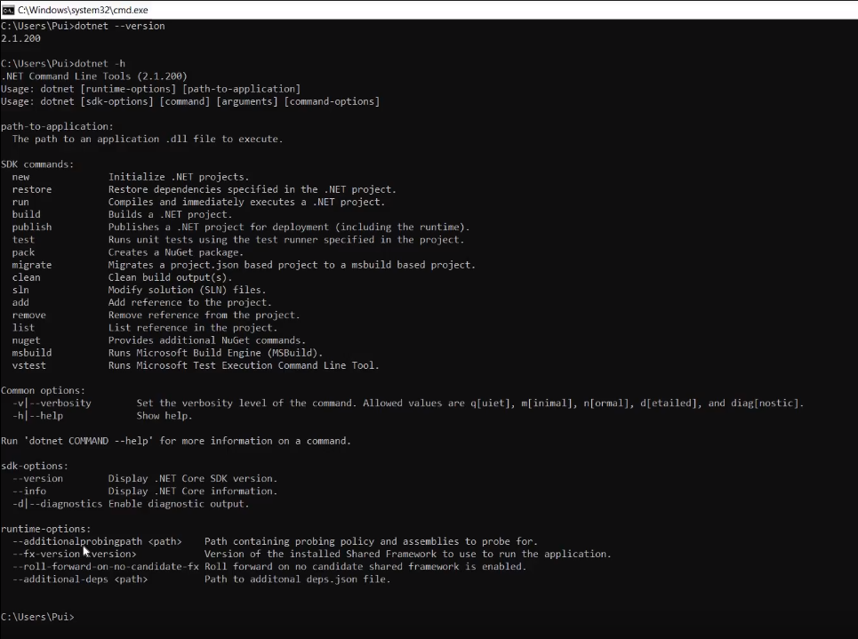
---

### VDO Link :  

