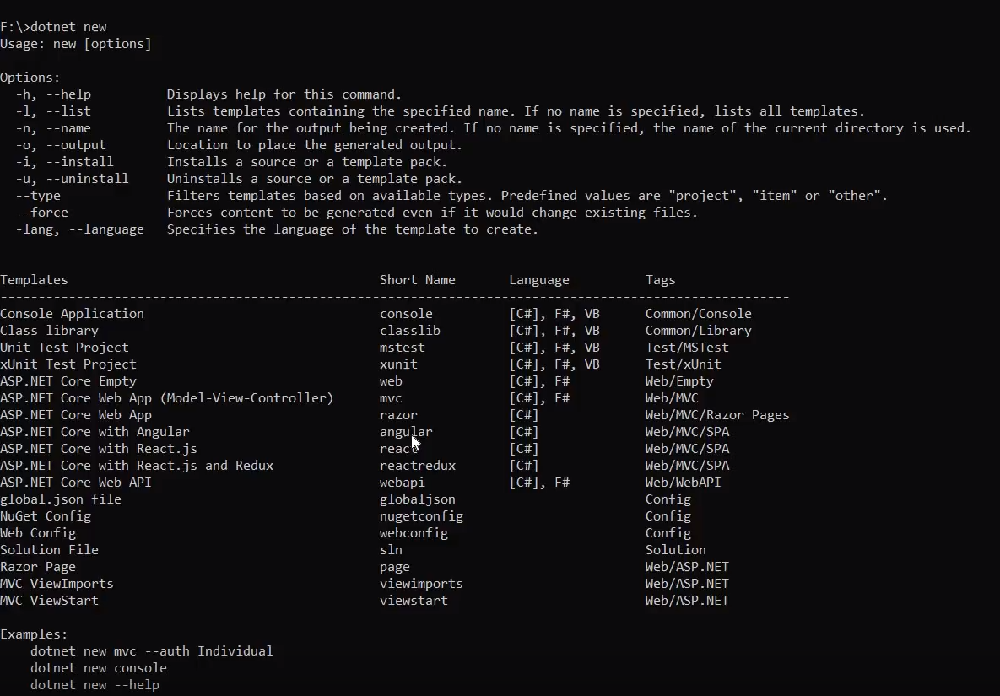

# ASP.NET CORE + ANGULAR

ใช้ดูคำสั่งต่างของ ASP.NET CORE  

A>dotnet -h

สำหรับการสร้างโปรเจคใช้ 

A>dotnet new 

จะมี Template มาให้เลือก

* * *

คำสั่งเพื่อสร้าง angular

A>dotnet new angular -n demoweb

รอซักครู่เพื่อทำการสร้างโปรเจค (demoweb สามารถตั้งชื่อเองตามที่ต้องการ)

* * *

เราจะต้องลง npm install เพื่อเพิ่มpacket 

A>npm install 

ใช้เวลาซักครู่ในการลง npm

* * *

วิธีเช็คโปรเจ็คติดตั้งเรียบร้อยหหรือไม่พิมพ์

A>dotnet build

 ใช้เวลาซักครู่เพื่อให้โปรเจค build   สามารถเช็คว่ามี error ไหมดูได้ที่นี้  

* * *

วิธีการเปิดเว็บไซต์  

A>dotnet run  

รอซักครู่เพื่อเตรียมserver ในการรันเว็บไซต์ ให้copy เพื่อทำการเปิดเว็บไซต์  

* * *

วิธีการปิดserver   
ให้กดปุ่ม CTRL + C  เพื่อทำการปิดserver  

* * *

A>หมายเหตุ  
A>ห้ามปิดcmd ใรขณะที่เปิดserverอยู่   เพราะถ้าปิดจะทำให้ไม่สามารถรันserverได้  
