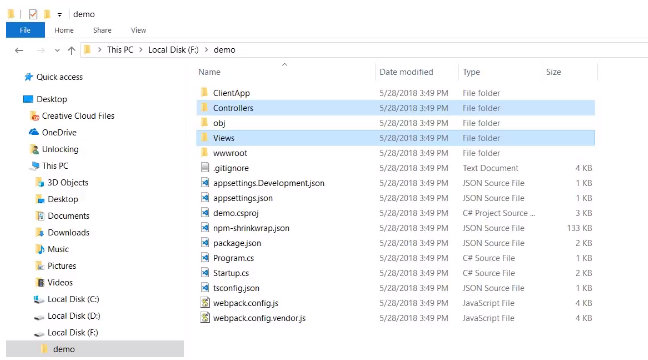

# โครงสร้างโปรเจคของ ASP.NET

ASP.NET Core 

* เป็นการจำลองserverให้runในเครื่อง

Angular

* สร้างScript 

* * *

ClientApp  

* เป็นโครงสร้างหลักของ Angular

* * *

Controllers กับ Views

* เป็นโครงสร้างของ ASP.NET Core

