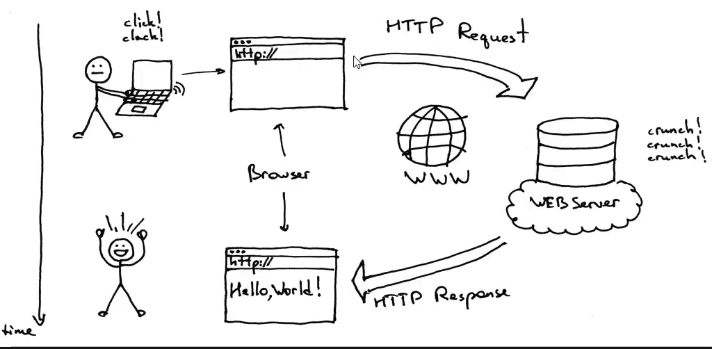

# EP 06-01 Basic Concept of Client Server

## Client server คืออะไร ?

Client คือฝ่ายที่ร้องขอข้อมูลเว็บไซต์จากServer

Request คือ การร้องขอข้อมูลเว็บไซต์โดยที่ฝ่าย Client เป็นผู้ร้องขอ

Server ทำหน้าที่ส่งข้อมูลเว็บไซต์ให้กับ Client ที่ร้องขอเว็บไซต์มา
หากมี Request สิ่งใดจาก Client เข้ามา Server จะให้บริการสิ่งนั้น และแสดงข้อมูลของเว็บไซต์นั้นบน Browser

Client ส่ง HTTP Request ผ่าน Browser ไปที่ Server

Server ทำการประมวลผล HTTP Request แล้ว ส่ง HTTP Response ไปที่ Browser ของ Client

[VDO Link : ](http://www.youtube.com/watch?v=ZRSdWeuwgCQ)

