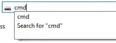
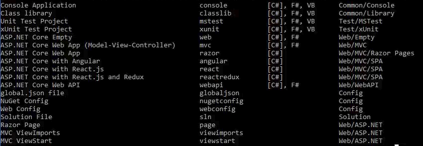
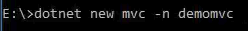
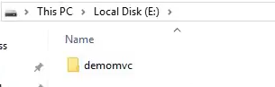
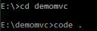
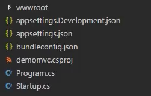
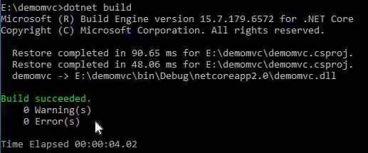
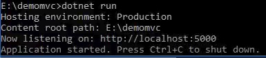
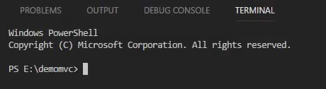
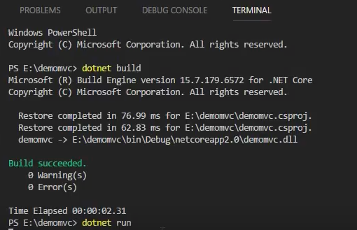

# การสร้างโปรเจค ASP.NET Core MVC

### ติดตั้ง ASP.NET Core MVC

1) เข้าไปใน directory ที่ต้องการสร้าง ASP.NET Core MVC เปิด cmd ในช่อง directory  

2) ใช้คำสั่ง  

A>dotnet new

ในตัวอย่าง ต้องการสร้างในไดรฟ์ E

    

จะมี List template มาให้ดู   

  

ตัวที่เราต้องการสร้างตือ  

 

3) ใช้คำสั่ง     

A>dotnet new mvc -n demomvc

  

A>bash
A>mvc     ตัวย่อของชื่อ template  
A>-n      คำสั่งในการตั้งชื่อโฟลเดอร์  
A>demomvc ชื่อโฟลเดอร์ที่ต้องการตั้ง

จะได้  

 

* * *

เปิด Visual Studio Code ด้วยคำสั่ง  

A>cd demomvc

A>demomvc>code .

จะเจอไฟล์ที่เป็นโครงสร้างของ ASP.NET Core MVC  

### Run Server โดยใช้ Cmd

ทดลอง run โดยการใช้คำสั่ง 

A>dotnet build  

ใช้คำสั่ง dotnet run เพื่อจำลอง server  

นำ  ไปเปิดบน brower ได้เลย

### Run Server โดยใช้ Visual Studio Code

เปิด Terminal ด้วยการกดปุ่ม Ctrl + ~ ` จะได้หน้าต่าง  

ใช้คำสั่ง dotnet build / dotnet run ในหน้าต่าง terminal ได้เลย  

[VDO Link : ](http://www.youtube.com/watch?v=krTTYJTe82c)

