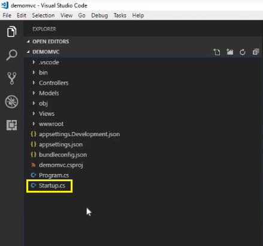
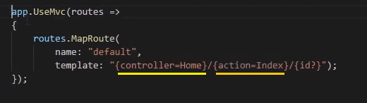

# EP 06-03 Structure Project ASP.NET Core MVC

### โครงสร้างโปรเจค ASP.NET Core MVC

* เมื่อทำการ run server ของโปรเจค โดยไปที่ Debug -> Start Without Debugging (หรือกดคีย์ลัด Ctrl+F5)  

* * *

* เมื่อ run Server สำเร็จ ก็จะทำการเปิด Website ขึ้นมา  

* * *

### เราจะไปดูกันว่า สิ่งที่ทำให้ Server สามารถเปิดหน้า Website นี้ขึ้นมาให้เราได้ มีส่วนประกอบอะไรบ้าง

1) Server จะ run จากไฟล์ Startup.cs  

* * *

2) เมื่อเข้าไปดูที่ไฟล์ Startup.cs เและเลื่อนลงไปด้านล่างสุด จะมี default routing  

* * *

3) ซึ่ง default จะวิ่งไปที่ controller ที่ชื่อว่า Home กับ action ที่ชื่อว่า Index  

* * *

4) จากนั้นลองกดไปที่ Controllers คลิกที่ไฟล์ HomeController.cs จะปรากฏ action ที่ชื่อว่า Index อยู่ ซึ่งจะเห็นว่าภายใน Index() จะมี View  

* * *

5) ลองกดไปที่ View -> Home คลิกที่ไฟล์ Index.cshtml จะปรากฏไฟล์ HTML ที่ Server นำมาแสดงผลเป็น Website จากที่ได้ run ไปข้างต้น  

* * *

6) ซึ่งทุกอย่างที่เห็นจากฝั่งซ้ายมือ คือสิ่งที่เกิดจากไฟล์ HTML ในฝั่งขวามือ 

* * *

7) และหากเราลองแก้ไข Code จากไฟล์ Index.cshtml ตัว Website ก็จะเปลี่ยนตามไปด้วย  

* * *

[VDO Link : ](http://www.youtube.com/watch?v=tpMTZClsE6Y)

