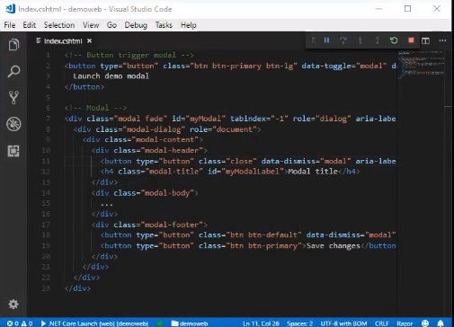

# EP 07-03 Bootstrap JavaScripts

### ส่วนประกอบหลัก 3 ส่วน ที่ใช้ประกอบการบรรยายในวิดีโอนี้

1) JavaScript - Bootstrap  
แหล่งรวบรวม Components ต่างๆ ที่เราสามารถคัดลอก Code มาใช้พัฒนา Web ได้เลย โดยที่ไม่ต้องเขียน Code  

 

https://getbootstrap.com/docs/3.3/javascript/ 

* * *

2) VS Code  
โปรแกรม IDE ที่ช่วยในการเขียน Code ได้ง่ายขึ้น  

  

* * *

3) Web Demo  
เพื่อตรวจสอบระหว่างการพัฒนา Web ว่ามีหน้าตาเปลี่ยนไปอย่างไร 

  

* * *

### วิธีการเลือกใช้ Components ของ Bootstrap

* เข้าไปที่ Modal เลื่อนลงมาจะเห็น ตัวอย่างของ Modal title ดังนี้  

  

* * *

* สามารถดูตัวอย่างได้ที่ Live demo modal  

  

* * *

* จะปรากฏหน้าต่างแสดงตัวอย่าง Modal  

  

* * *

### ตัวอย่างการใช้ Component ของ Bootstrap (Modal)

* หากต้องการใช้ component นี้ สามารถคัดลอก code (ในกรอบสีแดง) นำไปใช้ได้เลย  

  

* * *

* ทำการคัดลอก code และนำมาวาง  

  

* * *

* เมื่อเปิดหน้า Web ขึ้นมา ก็จะปรากฏดังภาพ  

  

* * *

* เมื่อกดที่ Launch demo modal ก็จะปรากฏดังภาพ  

 

* * *

### ส่วนประกอบต่างๆ ของ Code
1) ส่วนที่เป็น Button  

Code  

  

สิ่งที่แสดงผล  

  

* * *

2) ส่วนที่เป็น Modal  

Code  

  

สิ่งที่แสดงผล  

  

ซึ่งเราสามารถปรับแต่ง component ให้ตรงตามความต้องการได้

* * *

ซึ่งทาง Boostrap นั้นมี Conponents ต่างๆ มากมายให้เลือกใช้  
สามารถศึกษาเพิ่มเติมได้ที่ VDO ข้างล่าง

[VDO Link : ](http://www.youtube.com/watch?v=6NmsLYSUkyU)

หรือเข้าไปทดลองเลือกใช้งานดัวตัวเองได้ที่ https://getbootstrap.com/docs/3.3/javascript/ 