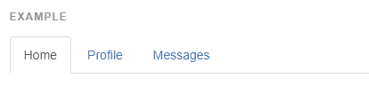
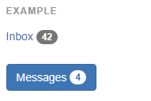

# EP 07-02 Bootstrap Components ที่น่าสนใจ

Components คือ กลุ่มของ code ที่ Bootstrap เตรียมไว้ให้ เราสามารถเรียกใช้ได้ตามที่เราต้องการ

A>https://getbootstrap.com/docs/3.3/components/

วิธีการนำ code ที่ต้องการไปใช้ สามารถทำได้โดย copy code ที่ Bootstrap เตรียมไว้ให้ ไปวางไว้ในไฟล์ html ของเราได้เลย ซึ่งมี Components ที่น่าสนใจ ดังนี้

### Glyphicons

คือ icon ต่างๆ ที่ Bootstrap เตรียมไว้ให้ ตัวอย่างคือ

A> 

เราสามารถเปลี่ยนรูป icon ให้เป็นรูปที่เราต้องการได้โดยการไป copy ชื่อรูปลงไปแทนใน class="ชื่อรูป"   

ตัวอย่าง การนำ code ไปใช้รวมกับ Components อื่น

A>
<button type="button" class="btn btn-default" aria-label="Left Align">
  
</button>
A>

จากตัวอย่างคือการนำเอา icon ไปใส่ไว้ใน button

* * *

### Dropdowns & Dropup  

  

จะมีตัวอย่าง code ดังนี้

˜˜˜˜˜˜˜˜

  <button class="btn btn-default dropdown-toggle" type="button" id="dropdownMenu1" data-toggle="dropdown" aria-haspopup="true" aria-expanded="true">
    Dropdown
    
  </button>
  <ul class="dropdown-menu" aria-labelledby="dropdownMenu1">
    <li><a href="#">Action</a></li>
    <li><a href="#">Another action</a></li>
    <li><a href="#">Something else here</a></li>
    <li role="separator" class="divider"></li>
    <li><a href="#">Separated link</a></li>
  </ul>

˜˜˜˜˜˜˜˜

  

จะมีตัวอย่าง code ดังนี้

˜˜˜˜˜˜˜˜

  <button class="btn btn-default dropdown-toggle" type="button" id="dropdownMenu2" data-toggle="dropdown" aria-haspopup="true" aria-expanded="false">
    Dropup
    
  </button>
  <ul class="dropdown-menu" aria-labelledby="dropdownMenu2">
    <li><a href="#">Action</a></li>
    <li><a href="#">Another action</a></li>
    <li><a href="#">Something else here</a></li>
    <li role="separator" class="divider"></li>
    <li><a href="#">Separated link</a></li>
  </ul>

˜˜˜˜˜˜˜˜

### Button groups

  

จะมีตัวอย่าง code ดังนี้

* * *

  <button type="button" class="btn btn-default">Left</button>
  <button type="button" class="btn btn-default">Middle</button>
  <button type="button" class="btn btn-default">Right</button>

* * *

### Button dropdowns

### Single button dropdowns

  

จะมีตัวอย่าง code ดังนี้

* * *

  <button type="button" class="btn btn-default dropdown-toggle" data-toggle="dropdown" aria-haspopup="true" aria-expanded="false">
    Action 
  </button>
  <ul class="dropdown-menu">
    <li><a href="#">Action</a></li>
    <li><a href="#">Another action</a></li>
    <li><a href="#">Something else here</a></li>
    <li role="separator" class="divider"></li>
    <li><a href="#">Separated link</a></li>
  </ul>

* * *

### Split button dropdowns

  

จะมีตัวอย่าง code ดังนี้

* * *

  <button type="button" class="btn btn-danger">Action</button>
  <button type="button" class="btn btn-danger dropdown-toggle" data-toggle="dropdown" aria-haspopup="true" aria-expanded="false">
    
    Toggle Dropdown
  </button>
  <ul class="dropdown-menu">
    <li><a href="#">Action</a></li>
    <li><a href="#">Another action</a></li>
    <li><a href="#">Something else here</a></li>
    <li role="separator" class="divider"></li>
    <li><a href="#">Separated link</a></li>
  </ul>

* * *

### Input groups

 

จะมีตัวอย่าง code ดังนี้

* * *

  @
  <input type="text" class="form-control" placeholder="Username" aria-describedby="basic-addon1">

  <input type="text" class="form-control" placeholder="Recipient's username" aria-describedby="basic-addon2">
  @example.com

  $
  <input type="text" class="form-control" aria-label="Amount (to the nearest dollar)">
  .00

<label for="basic-url">Your vanity URL</label>

  https://example.com/users/
  <input type="text" class="form-control" id="basic-url" aria-describedby="basic-addon3">

* * *

### Tabs

  

จะมีตัวอย่าง code ดังนี้

* * *

<ul class="nav nav-tabs">
  <li role="presentation" class="active"><a href="#">Home</a></li>
  <li role="presentation"><a href="#">Profile</a></li>
  <li role="presentation"><a href="#">Messages</a></li>
</ul>

* * *

### Navbar

  

จะมีตัวอย่าง code ดังนี้

* * *

<nav class="navbar navbar-default">
  

    <!-- Brand and toggle get grouped for better mobile display -->
    

      <button type="button" class="navbar-toggle collapsed" data-toggle="collapse" data-target="#bs-example-navbar-collapse-1" aria-expanded="false">
        Toggle navigation
        
        
        
      </button>
      <a class="navbar-brand" href="#">Brand</a>
    

    <!-- Collect the nav links, forms, and other content for toggling -->
    

      <ul class="nav navbar-nav">
        <li class="active"><a href="#">Link (current)</a></li>
        <li><a href="#">Link</a></li>
        <li class="dropdown">
          <a href="#" class="dropdown-toggle" data-toggle="dropdown" role="button" aria-haspopup="true" aria-expanded="false">Dropdown </a>
          <ul class="dropdown-menu">
            <li><a href="#">Action</a></li>
            <li><a href="#">Another action</a></li>
            <li><a href="#">Something else here</a></li>
            <li role="separator" class="divider"></li>
            <li><a href="#">Separated link</a></li>
            <li role="separator" class="divider"></li>
            <li><a href="#">One more separated link</a></li>
          </ul>
        </li>
      </ul>
      <form class="navbar-form navbar-left">
        

          <input type="text" class="form-control" placeholder="Search">
        

        <button type="submit" class="btn btn-default">Submit</button>
      </form>
      <ul class="nav navbar-nav navbar-right">
        <li><a href="#">Link</a></li>
        <li class="dropdown">
          <a href="#" class="dropdown-toggle" data-toggle="dropdown" role="button" aria-haspopup="true" aria-expanded="false">Dropdown </a>
          <ul class="dropdown-menu">
            <li><a href="#">Action</a></li>
            <li><a href="#">Another action</a></li>
            <li><a href="#">Something else here</a></li>
            <li role="separator" class="divider"></li>
            <li><a href="#">Separated link</a></li>
          </ul>
        </li>
      </ul>
    
<!-- /.navbar-collapse -->
  
<!-- /.container-fluid -->
</nav>

* * *

### Breadcrumbs

  

จะมีตัวอย่าง code ดังนี้

* * *

<ol class="breadcrumb">
  <li><a href="#">Home</a></li>
  <li><a href="#">Library</a></li>
  <li class="active">Data</li>
</ol>

* * *

### Pagination

  

จะมีตัวอย่าง code ดังนี้

* * *

<nav aria-label="Page navigation">
  <ul class="pagination">
    <li>
      <a href="#" aria-label="Previous">
        &laquo;
      </a>
    </li>
    <li><a href="#">1</a></li>
    <li><a href="#">2</a></li>
    <li><a href="#">3</a></li>
    <li><a href="#">4</a></li>
    <li><a href="#">5</a></li>
    <li>
      <a href="#" aria-label="Next">
        &raquo;
      </a>
    </li>
  </ul>
</nav>

* * *

### Labels

  

จะมีตัวอย่าง code ดังนี้

* * *

Default
Primary
Success
Info
Warning
Danger

* * *

### Badges

  

จะมีตัวอย่าง code ดังนี้

* * *

<a href="#">Inbox 42</a>

<button class="btn btn-primary" type="button">
  Messages 4
</button>

* * *

### Jumbotron (ทำ hight light พื้นหลัง)

  

จะมีตัวอย่าง code ดังนี้

* * *

  <h1>Hello, world!</h1>
  
...

  
<a class="btn btn-primary btn-lg" href="#" role="button">Learn more</a>

* * *

### Alerts

  

จะมีตัวอย่าง code ดังนี้

* * *

  <h1>Hello, world!</h1>
  
...

  
<a class="btn btn-primary btn-lg" href="#" role="button">Learn more</a>

* * *

### Responsive embed

  

จะมีตัวอย่าง code ดังนี้

* * *

<!-- 16:9 aspect ratio -->

  <iframe class="embed-responsive-item" src="..."></iframe>

<!-- 4:3 aspect ratio -->

  <iframe class="embed-responsive-item" src="..."></iframe>

* * *

[VDO Link : ](http://www.youtube.com/watch?v=SR7hmlsIzWw)

Unlocking TFC