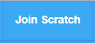

# EP 09-01 แนะนำ Scratch

  โปรแกรม Scratch (อ่านว่า สะ-แครช) 
  เป็นโปรแกรมที่ให้ผู้เรียน สามารถทดลองทำโปรเจคง่ายๆ เช่น เกมส์ ดนตรี ศิลปะ 
  จุดเด่นของ Scratch คือ จะใช้ภาษาที่เข้าใจง่ายใกล้เคียงกับประโยคที่เราใช้คุยกันในชีวิตประจำวัน
  โดยจะมีการจำลองภาษาง่ายๆ เพื่อให้เข้าใจแนวคิดในการเขียนโค้ด
  ได้เรียนการคิดลำดับอย่างมีเหตุผล และสร้างสรรค์ไปพร้อมๆกัน  
  

### สมัครสมาชิก Scratch

คลิกที่ Join Scratch  

กรอก Username และ password ให้ครบ  

  

กรอกวันเกิด เพศ และประเทศ

  

กรอก e-mail  

  

