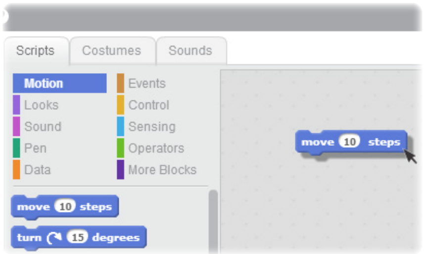
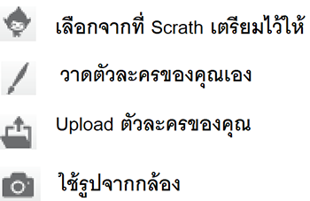

# EP 09-03 SCRATCH เบื้องต้น

บทนี้เราจะมาทำความเข้าใจการทำงานของ Scratch ด้วยการทำเกมส์ง่ายๆ โดยจะมีการจำลองภาษาง่ายๆ เพื่อให้เข้าใจแนวคิด และลำดับความเข้าใจในการเขียนโค้ดเบื้องต้นครับ

## เริ่มสร้าง project

ไปที่ SCRATCH และ คลิก Create  

  

ถ้าคุณมี SCRATCH account ให้ลงชื่อเข้าให้เพื่อจัดเก็บ Project  

  

* * *

## เริ่มเคลื่อนไหว

ลากกล่อง Move ไปที่ Scripts area  

  

คลิกที่กล่องแล้ว แมว จะเคลื่อนที่  

  

* * *

## เพิ่มเสียง

ลากกล่อง PLAY DRUM ไปวางไว้ข้างล่างกล่อง MOVE  

  

คลิกเพื่อฟังเสียง  

  

สามารถเปลี่ยนเสียงกลองต่างๆ ได้ โดยการ  

  

* * *

## เต้น

เพิ่มกล่อง MOVE คลิกข้างในกล่อง เพื่อเปลี่ยนตำแหน่งการเคลื่อนไหว  

  

เพิ่มกล่อง PLAY DRUM แล้วเปลี่ยนเสียงกลองในเมนู  

* * *

## ทำซ้ำ

ลากกล่อง REPEAT แล้ววางครอบกล่องต่างๆ ที่มีอยู่อยู่แล้ว  

  

สามารถกำหนดจำนวนรอบได้โดย  

  

* * *

## กล่องข้อความ

คลิก LOOKS category และลากกล่อง SAY  

  

คลิก ข้างในกล่อง SAY แล้วเปลี่ยนคำที่ต้องการ  

  

ลากกล่อง SAY ไปไว้ข้างบนสุด  

* * *

## ธงเขียว

ลากกล่อง 

  

นำไปไว้ข้างบนสุด  
คลิกธงเขียวเพื่อนเริ่ม  
คลิกปุ่มหยุด เพื่อหยุด  

  

* * *

## เปลี่ยนสี

ลากกล่อง CHANGE EFFECT  

  

คลิกเพื่อดูการเปลี่ยนแปลง

  

* * *

## ปุ่มกด

ลากกล่อง  

  

เปลี่ยน Key ที่ต้องการ  

  

* * *

## เปลี่ยนพื้นหลัง

คลิกเพื่อนเปลี่ยนพื้นหลัง  

  

เลือกพื้นหลังที่ต้องการ  

  

* * *

## เพิ่มตัวละคร

  

* * *
A>
 ท่านสามารถลองตัวอย่างอื่นๆได้ที่
[https://scratch.mit.edu/tips]
(https://scratch.mit.edu/tips)
 Note : website จะนี้ใช้ Flash Player ในกรณีที่ท่านใช้ Browser Chrome จะไม่รองรับ
A>