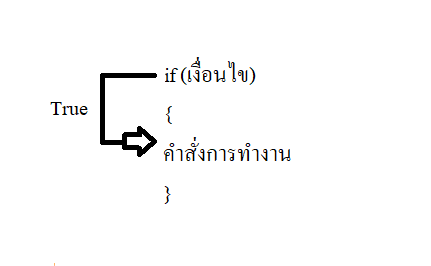
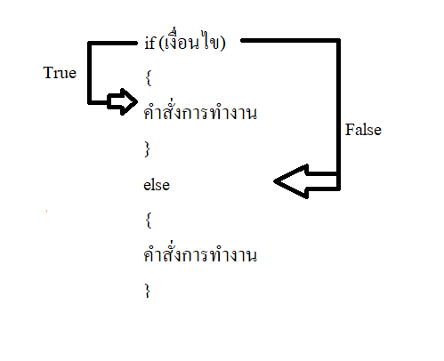
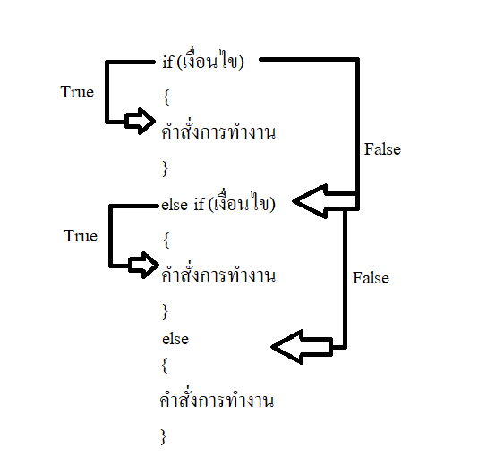

# EP 11-03 IF ELSE

if-else จะมีอยู่3ส่วนหลักๆ 
1) IF  

คำสั่ง if ใช้สำหรับเปรียบเทียบเงื่อนไขว่าตรงตามที่กำหนดไว้หรือไม่ หากตรงตามเงื่อนไขก็จะทำตามคำสั่งนั้นๆ
 แต่ถ้าหากไม่ตรงก็จะข้ามไปคำสั่งถัดไป มีรูปแบบดังนี้

*** 
  
2) IF-ELSE  

คำสั่ง if-else เป็นการกำหนดทางเลือก ถ้าหากเงื่อนไขที่กำหนดไว้เป็นจริง ก็จะเข้าไปทำงานใน if แต่ถ้าเงื่อนไขเป็นเท็จ จะข้ามไปทำงานในคำสั่ง else แทน มีรูปแบบดังนี้

***

3) ELSE-IF  

คำสั่ง else if ใช้ในกรณีที่มีเงื่อนไขที่แตกต่างกันหลายเงื่อนไข เสมือนเป็นการยุบ if-else หลายๆอันรวมกัน ทำให้ประหยัดเวลาในการทำงานของโปรแกรม มีรูปแบบดังนี้

A>
หมายเหตุ : 
เงื่อนไขจะเป็นรูปแบบของ boolean เสมอและข้อมูลที่เก็บค่าความเป็นจริงหรือเท็จเท่านั้น ข้อมูลแบบ boolean นี้เป็นการกำหนดหรือสร้างสถานะเพื่อใช้เป็นเงื่อนไขของโปรแกรม 
A>

[VDO Link : ](https://youtu.be/VAxjLra6HjU)

UnlockingTFG
