# EP 11-04 Loop

### 1) While loop  

ลักษณะการทำงานของ While loop คือ จะตรวจสอบเงื่อนไขก่อนที่จะเข้าไปทำงาน Statement ที่อยู่ภายในบล็อก ทำวนซ้ำไปเรื่อยๆ จนกว่าเงื่อนที่ไขที่ตั้งไว้จะกลายเป็นเท็จ

* คำสั่ง While loop  

{line-numbers=off}
~~~~~~~~
while ( CONDITION )
{
    //statement 1
    //statement 2
    .
    .
    .
}
~~~~~~~~

* ตัวอย่างการใช้คำสั่ง While loop  

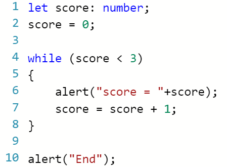  

1) เริ่มต้นกำหนดค่า score = 0
2) คำสั่ง while loop จะเข้าไปทำสิ่งที่อยู่ภายในบล็อคได้ ก็ต่อเมื่อ score มีค่าน้อยกว่า 3
3) หากเงื่อนไขข้างต้นเป็นจริง จะแสดง alert เป็นข้อความ "score = [ค่าของ score]" และ เปลี่ยนค่า score ให้เท่ากับ score + 1
4) ทำวนซ้ำไปเรื่อยๆ จนกว่าเงื่อนไขเป็นเท็จ (ค่าของ score ไม่น้อยกว่า 3)
5) เมื่อเงื่อนไขเป็นเท็จ จะออกจาก loop แล้วแสดง alert เป็นข้อความ "End"  

#### สิ่งที่เกิดขึ้นจากการ Run While loop  

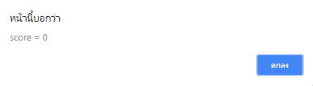  
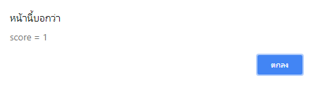  
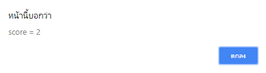  
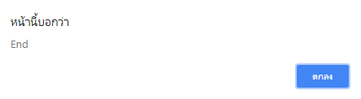  

* * *

### 2) Do while loop

ลักษณะการทำงานของ Do while loop คือ จะทำงาน Statement ที่อยู่ภายในบล็อคก่อน 1 รอบ แล้วจึงตรวจสอบเงื่อนไข และทำวนซ้ำไปเรื่อยๆ จนกว่าเงื่อนที่ไขที่ตั้งไว้จะกลายเป็นเท็จ

* คำสั่ง While loop  

{line-numbers=off}
~~~~~~~~
do
{
    //STATEMENT 1
    //STATEMENT 2
    .
    .
    .
} while ( CONDITION )
~~~~~~~~

* ตัวอย่างการใช้คำสั่ง Do while loop  

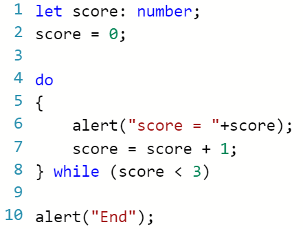  

1. เริ่มต้นกำหนดค่า score = 0
2. คำสั่ง do while loop จะทำสิ่งที่อยู่ภายในบล็อคก่อน 1 รอบ แล้วจึงตรวจสอบเงื่อนไข คือ จะเข้าไปทำสิ่งที่อยู่ภายในบล็อคได้ ก็ต่อเมื่อ score มีค่าน้อยกว่า 3
3. หากเงื่อนไขข้างต้นเป็นจริง จะแสดง alert เป็นข้อความ "score = [ค่าของ score]" และ เปลี่ยนค่า score ให้เท่ากับ score + 1
4. ทำวนซ้ำไปเรื่อยๆ จนกว่าเงื่อนไขเป็นเท็จ (ค่าของ score ไม่น้อยกว่า 3)
5. เมื่อเงื่อนไขเป็นเท็จ จะออกจาก loop แล้วแสดง alert เป็นข้อความ "End" 

#### สิ่งที่เกิดขึ้นจากการ Run คำสั่ง Do while loop  

  
  
  
  

*จากตัวอย่างข้างต้น จะเห็นได้ว่า การทำงานของคำสั่ง Do while loop กับ คำสั่ง While loop เหมือนกัน*

* * *

### ความแตกต่างระหว่างคำสั่ง While loop กับ Do while loop

ความแตกต่างระหว่าง 2 คำสั่งนี้ คือ คำสั่ง While loop จะไม่เข้าไปทำสิ่งที่อยู่ภายในบล็อค หากเงื่อนไขเป็นเท็จ แต่คำสั่ง Do while loop จะเข้าไปทำสิ่งที่อยู่ภายในบล็อคก่อน 1 รอบ แล้วจึงตรวจสอบเงื่อนไข

* ตัวอย่างการใช้คำสั่ง While loop  

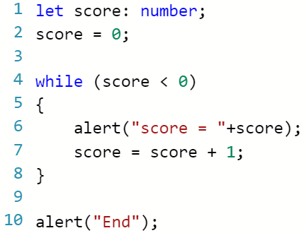  

1) เริ่มต้นกำหนดค่า score = 0
2) คำสั่ง while loop จะเข้าไปทำสิ่งที่อยู่ภายในบล็อคได้ ก็ต่อเมื่อ score มีค่าน้อยกว่า 0
3) พบว่าเงื่อนไขเป็นเท็จ ไม่สามารถเข้าไปทำสิ่งที่อยู่ภายในบล็อคได้ จึงออกจาก loop
4) เมื่อออกจาก loop จะแสดง alert เป็นข้อความ "End"

#### สิ่งที่เกิดขึ้นจากการ Run

  

* * *

* ตัวอย่างการใช้คำสั่ง Do while loop  

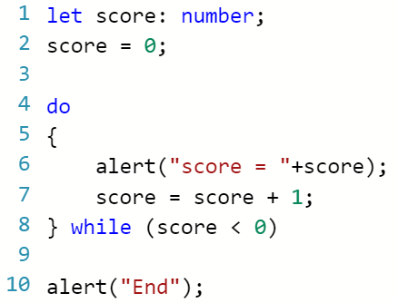  

1) เริ่มต้นกำหนดค่า score = 0
2) คำสั่ง do while loop จะทำสิ่งที่อยู่ภายในบล็อคก่อน 1 รอบ  
3) เมื่อทำสิ่งที่อยู่ภายในบล็อคเสร็จ จึงมาตรวจสอบเงื่อนไข พบว่าเงื่อนไขเป็นเท็จ จึงออกจาก loop
4) เมื่อออกจาก loop จะแสดง alert เป็นข้อความ "End"  

#### สิ่งที่เกิดขึ้นจากการ Run

  

  

* * *

### 3. For loop

ลักษณะการทำงานของ For loop คือ จะตรวจสอบเงื่อนไขก่อนที่จะเข้าไปทำงาน Statement ที่อยู่ภายในบล็อก และจะมีการเพิ่มหรือลดค่าเริ่มต้น ทำวนซ้ำไปเรื่อยๆ จนกว่าเงื่อนที่ไขที่ตั้งไว้จะกลายเป็นเท็จ

* คำสั่ง For loop 

{line-numbers=off}
~~~~~~~~
for ( INITIALIZER ; CONDITION ; ITERATOR )
{
    //STATEMENT 1
    //STATEMENT 2
    .
    .
    .
}
~~~~~~~~

* ตัวอย่างการใช้คำสั่ง For loop  

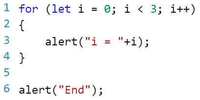  

1) เริ่มต้นกำหนดค่า(INITIALIZER) i = 0
2) ตรวจสอบเงื่อนไง(CONDITION) จะเข้าไปทำสิ่งที่อยู่ภายในบล็อคได้ ก็ต่อเมื่อ i มีค่าน้อยกว่า 3   
3) เมื่อทำสิ่งที่อยู่ภายในบล็อคเสร็จ จะทำการเพิ่มค่า i ขึ้นอีก 1 (ITERATOR)
4) เมื่อทำการเพิ่มค่าเสร็จ จึงกลับมาตรวจสอบเงื่อนไข 
5) ทำวนซ้ำไปเรื่อยๆ จนกว่าเงื่อนไขเป็นเท็จ (ค่าของ i ไม่น้อยกว่า 3)
6) เมื่อเงื่อนไขเป็นเท็จ จะออกจาก loop แล้วแสดง alert เป็นข้อความ "End"  

#### สิ่งที่เกิดขึ้นจากการ Run

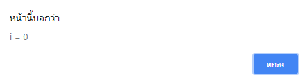  
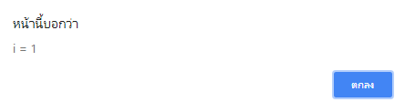  
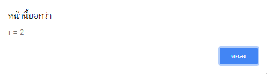  
  

* * *

[VDO Link : ]((https://www.youtube.com/watch?v=xNVTSZqgHXE)

