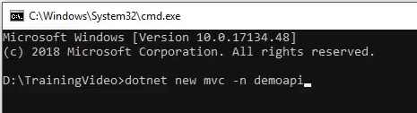
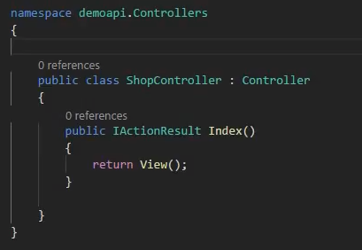
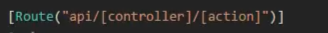
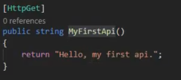
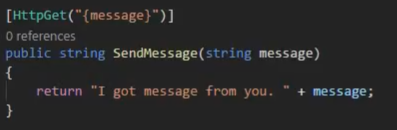

# EP 14-01 Start with HttpGet API

APi คือ MVC ชนิดหนึ่ง ซึ่งต่างจากกันตรงที่ MVC เราใช้สร้างหน้าเว็บต่าง แต่ API ใช้สำหรัับเรียกข้อมูลต่างๆ ที่เตรียมเอาไว้

### สร้าง API

เปิด cmd  เข้าไปที่โฟลเดอร์ที่ต้องการสร้าง  
ใช้คำสั่ง  

> dotnet new mvc -n nameAPI  

  

จะได้ เว็บ MVC ขึ้นมาตัวหนึ่ง

เริ่มสร้าง API โดยการเพิ่มไฟล์ Controller.cs วิธีง่ายๆ คือ Copy ไฟล์ HomeController.cs ที่มีอยู่แล้ว จากนั้น paste ไว้ตำแหน่งเดิม แล้วเปลี่ยนชื่อ โดยมีข้อกำหนดในการตั้งชื่อคือ เป็นชื่ออะไรก็ได้แล้วต่อด้วย Controller.cs (ห้ามเว้นวรรค) เช่น ShopController.cs

เปลี่ยนชื่อ Class ให้ตรงกับชื่อไฟล์ที่เราตั้ง และลบ Code ที่ไม่ใช้ออก

เพิ่ม Route  

  

หมายถึงการกำหนดแบบฟอร์มของ URL ในการเข้าถึงข้อมูล จากตัวอย่างข้างบนถ้าต้องการจะเรียกใช้ API ที่ชื่อว่า IActionResult เราต้องใช้ URL `localhost:5000/api/Shop/Index`  

### HttpGet แบบธรรมดา

  

เมื่อต้องการเรียก ต้องใช้ URL `localhost:5000/api/Shop/MyFirstApi` จะได้คำว่า "Hello, my first api." ออกมา

### HttpGet แบบมี parameter

คือ API ที่เมื่อต้องการเรียกใช้ จะต้องส่งค่าบางอย่างเข้าไปด้วย ค่าที่ส่งเข้าไปเรียกว่า parameter  

  

จากตัวอย่าง จะเห็นได้ว่ามี parameter ที่ชื่อว่า message เพิ่มเข้ามา และเราต้องไปเพิ่มไว้ข้างหลัง HttpGet ด้วย เมื่อต้องการเรียกใช้ API ตัวนี้ต้องเข้าไปที่ URL `localhost:5000/api/Shop/SendMessage/parameter` ถ้าเราส่ง parameter เข้าไปเป็น Hello เราจะได้คำว่า "I got message from you. Hello"

* * *

UnlockingTFC