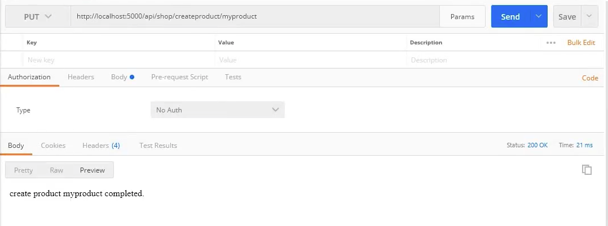

# EP 14-03 Postman

จากตัวอย่างที่ผ่านมาเราสามารถเรียกใช้ `HttpGet` โดยการใส่ URL ในหน้า web broswer แต่สำหรับ `HttpPost` และ `HttpPut` ไม่สามารถใช้วิธีดังกล่าวได้ ดังนั้นจึงต้องมีเครื่องมือบางอย่างเข้ามาช่วยในเรื่องนี้ ซึ่ง Postman คือหนึ่งในเครื่องมือที่ถูกออกแบบมาให้ทำหน้าที่ดังกล่าวได้  
สามารถ ดาวน์โหลดฟรี ได้ที่ [www.getpostman.com/](https://www.getpostman.com/)

### วิธีการใช้งาน postman

เลือก Verbs ที่เราต้องการ Test ใส่ URL แล้วคลิก Send

  

* * *

UnlockingTFC