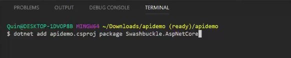
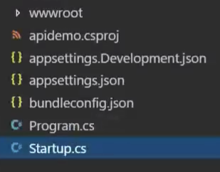
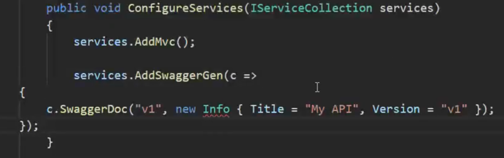
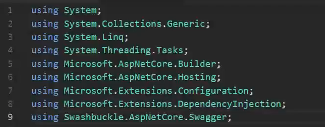
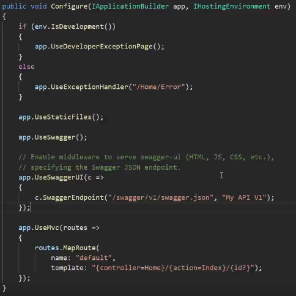
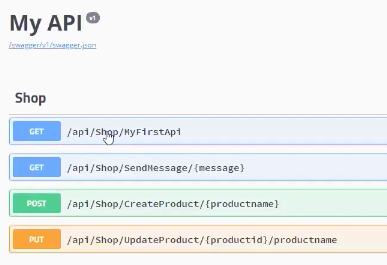
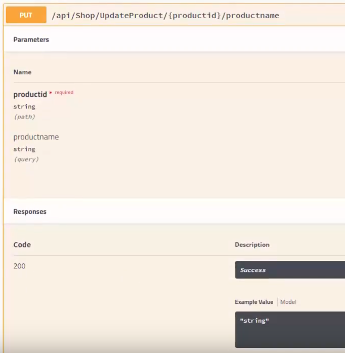

# EP 14-04 Swagger

Swagger คือ เครื่องมืออีกชนิดหนึ่ง มีหน้าที่ช่วยในการ test API เหมือนกับ Postman

### วิธีการติดตั้ง

ใน Visual Studio Code เปิดแทป Terminal โดยการคลิก View >> Open View แล้วเลือก Terminal  

copy 

A> dotnet add TodoApi.csproj package Swashbuckle.AspNetCore

แล้วเปลี่ยนชื่อจาก TodoApi.csproj เป็นชื่อ โปรเจคของเรา แล้วนำไปวางใน Terminal กด enter

  

ไปที่ไฟล์ Startup.cs  

copy

A>
    services.AddSwaggerGen(c =>
    {
        c.SwaggerDoc("v1", new Info { Title = "My API", Version = "v1" });
    });
A>

ไปวางไว้ใน method ที่ชื่อ ConfigureServices  

copy  

A> using Swashbuckle.AspNetCore.Swagger;

ไปไว้ที่ข้างบน  

copy

A>
    app.UseSwagger(); 
    app.UseSwaggerUI(c =>
    {
        c.SwaggerEndpoint("/swagger/v1/swagger.json", "My API V1");
    });
A>

ไปวางไว้ใน method ที่ชื่อ Configure เหนือ `app.UseMvc();`

ก็จะทำการติดตั้งเรียบร้อย

### การใช้งาน Swagger

เมื่อติดตั้งเรียบร้อย ให้เราใส่ URL 

A> `localhost:5000/swagger/index.html`

 ใน web broswer เราจะเห็น API ต่างๆ ที่เราทำไว้ใน project ของเรา

เมื่อเข้าไปดูใน API เราจะเห็นข้อมูลต่างๆของ API นั้น เช่น ต้องการ parameter กี่ตัว แต่ละตัวเป็นตัวแปรประเภทไหน เมื่อทำงานเสร็จแล้วจะส่งอะไรออกมา

  

หากต้องการ Test ให้คลิกที่ `Try it out` จะมีช่องให้ใส่ parameter ขึ้นมา ให้ใส่ parameter ให้ครบ แล้วคลิก Execute  

A>
 ข้อมูลเพิ่มเติม [Swagger](https://docs.microsoft.com/en-us/aspnet/core/tutorials/web-api-help-pages-using-swagger?view=aspnetcore-2.1)
A>

* * *

