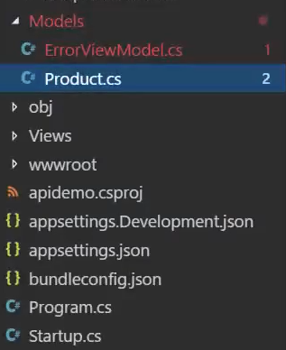
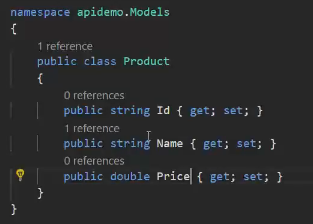
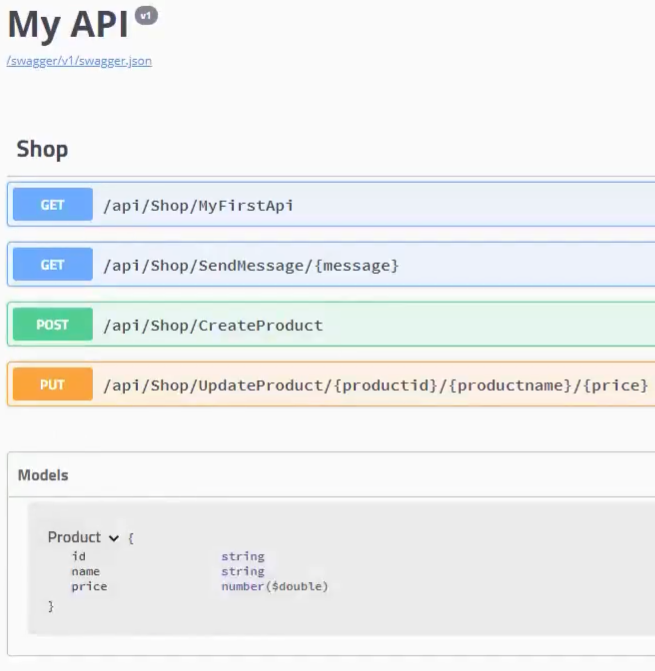
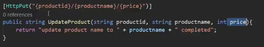
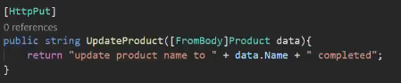

# EP 14-03 Model and JSON

ถ้าข้อมูลของเรามีรายละเอียดปลีกย่อยหลายๆ อย่าง อย่างเช่น สินค้าชนิดหนึ่ง มีรายละเอียดต่างๆ มากมายไม่ว่าจะเป็น รหัสสินค้า, ราคา, ประเภท, คำอธิบาย ซึ่งเมื่อเราเอาข้อมูลต่างๆ ไปทำเป็น API เราจะต้องใส่ parameter หลายตัว ทำให้ Code ของเราอาจผิดพลาดได้ ดังนั้น เราจะเก็บรายละเอียดต่างๆ ของข้อมูลในรูปแบบของ Model 

### การสร้าง Model  

สร้างไฟล์ ในโฟลเดอร์ Models ง่ายๆ ด้วยการ coppy ไฟล์ model ที่มีอยู่แล้ว แล้วเปลี่ยนชื่อ ลบข้อมูลมูลที่ไม่ใช้ออก

เปลี่ยนชื่อ class ให้เป็นชื่อเดียวกันกับชื่อไฟล์ แล้วใส่ข้อมูลรายละเอียดของข้อมูลลงไป

ในหน้า web API ของเราก็จะมี Model เพิ่มเข้ามา และมีรายละเอียดต่างๆ ตามที่เราได้สร้างไว้

การจัดการกับรายละเอียดต่างๆของข้อมูลในลักษณะนี้เรียกว่า `JSON`

### การนำ Model ไปใช้

จากที่เราต้องไปใส่ parameter มากมายในการสร้าง API

เราก็จะใส่ Model เข้าไปแทน  

* * *

