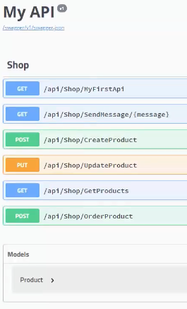
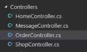
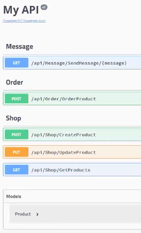

# EP 14-06 Grouping API

เมื่อ controller ของเราเริ่มมี API มากขึ้น หากมี API บางตัวทำงานผิดพลาด หรือเราต้องการแก้ไข API ตัวใดตัวหนึ่ง เราจะต้องมานั่งหา API ตัวที่ต้องการจาก Code จำนวนมาก ซึ่งไม่สะดวก ดังนั้น เราจึงต้องจัดแยก API ออกตามหมวดหมู่ เพื่อสะดวกแก่การค้นหา

การแยกกลุ่ม API ทำได้ด้วยการ เพิ่มไฟล์ Controller แล้วย้าย API ชนิดเดียวกันไปไว้ใน Controller เดียวกัน

หน้าตาของ web API ก็จะเปลี่ยนไป

* * *

UnlockingTFC