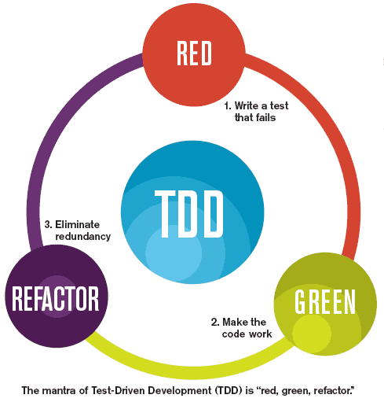

# EP 18-01 แนะนำ TDD

TDD
การพัฒนา software แบบ TDD เป็นการลดปัญหาในการอ่าน code ที่เขียนไว้เมื่อนานมาแล้ว ถ้าไม่ใช้ TDD ปัญหาที่เกิดขึ้นคือเมื่อเราอยากกลับไปแก้ใข code เก่าๆที่เคยเขียนไว้ เขียนต่อจากคนอื่นหรือ code ที่ไม่เหมาะสมในปัจจุบันจะเป็นการยากในการกลับไปทำความเข้าใจใหม่หรืออ่านใหม่ตั้งแต่เริ่มต้น TDD จึงลดปัญหาในการอ่าน code และการ design software ให้น้อยลง

UnlockingTFC
