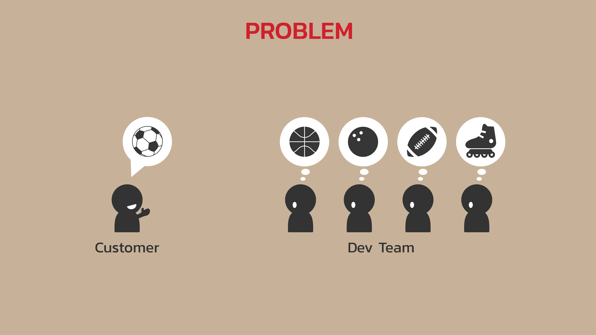
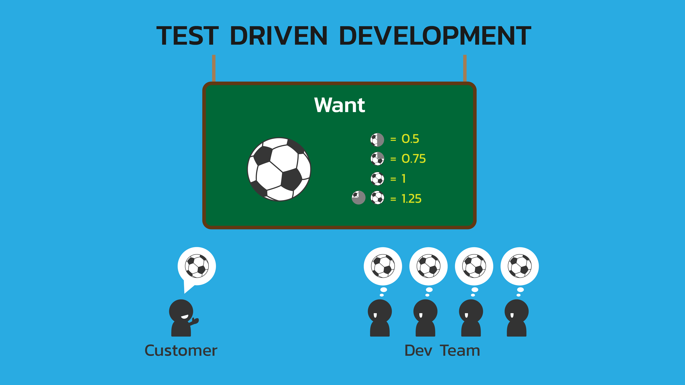
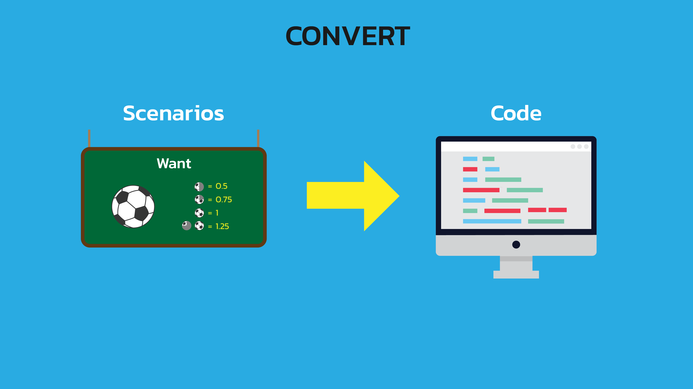
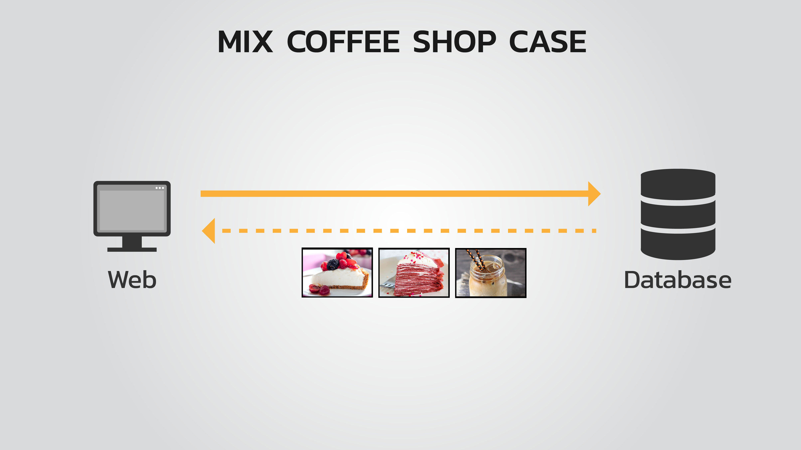
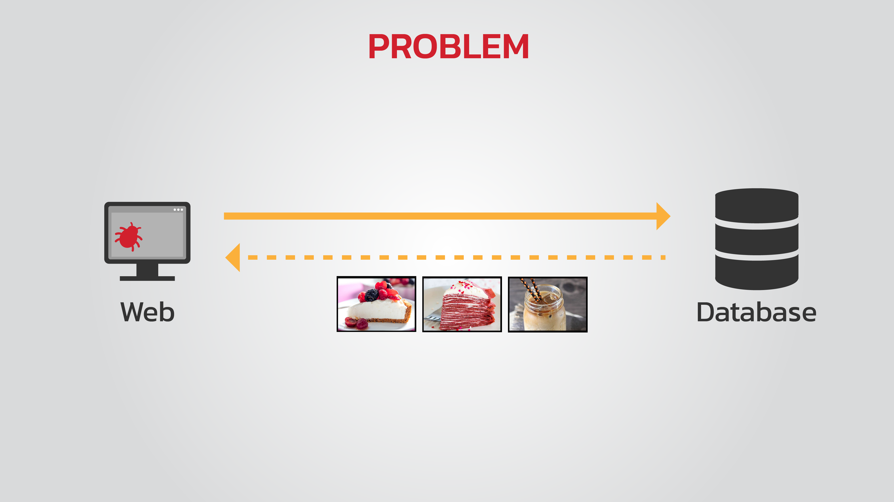
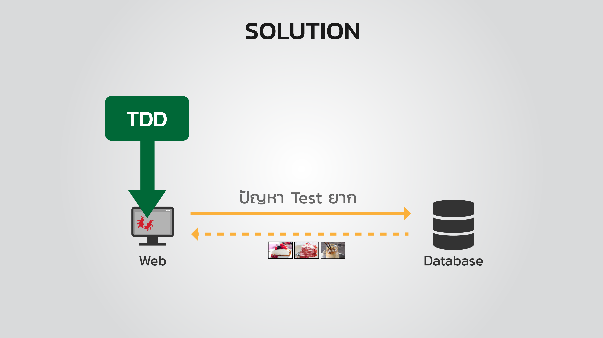
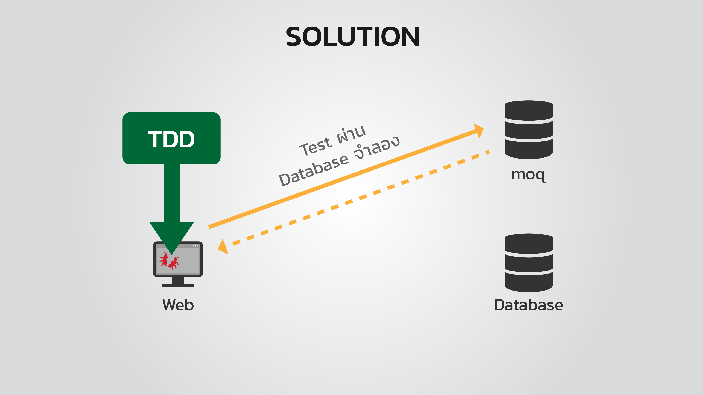

# EP.20 Coding Step
## Summary
- ทำให้ API สามารถแก้ไขสินค้าที่มี และเพิ่มสินค้าใหม่ได้ พร้อมกับทำ unit test  









## Solution

### Clone project จาก EP.19

- ใช้คำสั่ง

{line-number=off}
~~~~~~
git clone https://github.com/super-speed-training/unlocking-ep19.git
~~~~~~

### ใช้ความสามารถ dependency injection ของ ASP.Net Core เพื่อให้ API ใช้งาน ```ProductRepository``` ได้

- ที่ไฟล์ ```/mix-coffeeshop-web/Startup.cs``` function ``` public void ConfigureServices(IServiceCollection services)``` เพิ่ม code การลงทะเบียน class ```ProductRepository``` ให้ web api รู้จัก

{line-number=off}
~~~~~~
//add using model
using mix_coffeeshop_web.Models;

namespace mix_coffeeshop_web
{
    public class Startup
    {
        public void ConfigureServices(IServiceCollection services)
        {
            services.AddMvc();

            //add line below
            services.AddTransient<IProductRepository, ProductRepository>();

            //... some code ...//
        }
    }
}
~~~~~~

### แก้ไขไฟล์ ```/mix-coffeeshop-web/Controllers/ProductController.cs```

โดย inject class ```ProductRepository``` ที่ลงทะเบียนไว้เข้าไปใน costructor ```ProductController```

- สร้าง class varible ของ ```IProductRepository``` สำหรับให้ ```ProductController``` เรียกใช้

{line-number=off}
~~~~~~
[Route("[controller]/[action]")]
public class ProductController : Controller
{
    //add repository field
    private IProductRepository repo;

    //add constructor and inject IProductRepository 4 lines below
    public ProductController(IProductRepository repo)
    {
        this.repo = repo;
    }

    //... some code ...//
}
~~~~~~

- แก้ไข API ดึงรายการสินค้า และดึงข้อมูลสินค้าจาก id ให้ดึงจาก ```IProductRepository repo```

{line-number=off}
~~~~~~
[Route("[controller]/[action]")]
public class ProductController : Controller
{
    [HttpGet]
    public IEnumerable<Product> Get()
    {
        //delete line below
        //var repo = new ProductRepository();
        var products = repo.GetAllProducts();
        return products;
    }

    [HttpGet("{id}")]
    public Product Get(int id)
    {
        //add line below
        var products = repo.GetAllProducts();
        return products.FirstOrDefault(it => it.Id == id);
    }
}
~~~~~~

### แก้ไขไฟล์ ```/mix-coffeeshop-web/Controllers/HomeController.cs```

โดย inject class ```ProductRepository``` ที่ลงทะเบียนไว้เข้าไปใน costructor ```HomeController```

- สร้าง class varible ของ ```IProductRepository``` สำหรับให้ ```HomeController``` เรียกใช้

{line-number=off}
~~~~~~
public class HomeController : Controller
{
    //add repository field
    private IProductRepository repo;

    //add constructor and inject IProductRepository 4 lines below
    public HomeController(IProductRepository repo)
    {
        this.repo = repo;
    }

    //... some code ...//
}
~~~~~~

- แก้ไข API ต่างๆ 4 จุด ใน ```HomeController```

{line-number=off}
~~~~~~
public class HomeController : Controller
{
    public IActionResult MenuManager()
    {
        //edit line below
        var api = new ProductController(repo);
        var products = api.Get();
        return View(products);
    }

    [HttpPost]
    public IActionResult AddItem(Product data)
    {
        //edit line below
        var api = new ProductController(repo);
        api.CreateNewProduct(data);
        return RedirectToAction("MenuManager");
    }

    [HttpGet]
    public IActionResult EditItem(int id)
    {
        //edit line below
        var api = new ProductController(repo);
        var selectedProduct = api.Get().FirstOrDefault(it=> it.Id == id);
        return View(selectedProduct);
    }

    [HttpPost]
    public IActionResult EditItem(Product data)
    {
        //edit line below
        var api = new ProductController(repo);
        var selectedProduct = api.UpdateProduct(data);
        return RedirectToAction("MenuManager");
    }
}
~~~~~~

### แก้ไขไฟล์ unit test ```/mix-coffeeshop-web-test/GetAllProduct.cs```

implement unit test ให้ครบตาม scenario ที่วางไว้

- ที่ unit test 2 อันแรก ให้เปลี่ยนไป test ในระดับ controller (แก้ไข 4 จุด)

{line-number=off}
~~~~~~
public class UnitTest1
{
    [Fact(DisplayName = "Get products with correct data Then system return all products.")]
    public void GetAllProductSuccess()
    {
        var mock = new MockRepository(MockBehavior.Default);
        var repo = mock.Create<mix_coffeeshop_web.Models.IProductRepository>();
        //edit line below
        var api = new mix_coffeeshop_web.Controllers.ProductController(repo.Object);
        repo.Setup(it => it.GetAllProducts()).Returns(()=> new List<Product>
        {
            new Product(),
            new Product(),
            new Product(),
            new Product(),
        });
        //edit line below
        var products = api.Get();
        products.Should().HaveCount(4);
    }

    [Fact(DisplayName = "Get products when no products in the system Then system return 0 product.")]
    public void GetAllProductWhenNoDataInTheStorage()
    {
        var mock = new MockRepository(MockBehavior.Default);
        var repo = mock.Create<mix_coffeeshop_web.Models.IProductRepository>();
        //edit line below
        var api = new mix_coffeeshop_web.Controllers.ProductController(repo.Object);
        repo.Setup(it => it.GetAllProducts()).Returns(()=> new List<Product>
        {
        });
        //edit line below
        var products = api.Get();
        products.Should().HaveCount(0);
    }
}
~~~~~~

- เพิ่ม code สำหรับ test scenario ```Get a product with correct data Then system return the selected product``` ในไฟล์ unit test ```/mix-coffeeshop-web-test/GetAllProduct.cs```

{line-number=off}
~~~~~~
public class GetAllProduct
{
    [Fact(DisplayName = "Get products with correct data Then system return all products.")]
    public void GetAllProductSuccess()
    {
        //... some code ...//
    }

    //add this test method
    [Fact(DisplayName = "Get products when no products in the system Then system return 0 product.")]
    public void GetAllProductWhenNoDataInTheStorage()
    {
        //... some code ...//
    }

    //add this test method
    [Theory(DisplayName = "Get a product with correct data Then system return the selected product")]
    [InlineData(1, 1)]
    [InlineData(2, 2)]
    [InlineData(3, 3)]
    public void GetAnExistingProductFromId(int id, int expectedProductId)
    {
        var mock = new MockRepository(MockBehavior.Default);
        var repo = mock.Create<mix_coffeeshop_web.Models.IProductRepository>();
        var api = new mix_coffeeshop_web.Controllers.ProductController(repo.Object);
        var allProducts = new List<Product>
        {
            new Product{ Id = 1, Name = "name01", Price = 50, Desc = "desc01", ThumbURL = "img01.png" },
            new Product{ Id = 2, Name = "name02", Price = 60, Desc = "desc02", ThumbURL = "img02.png" },
            new Product{ Id = 3, Name = "name03", Price = 70, Desc = "desc03", ThumbURL = "img03.png" },
        };
        repo.Setup(it => it.GetAllProducts()).Returns(() => allProducts);
        var product = api.Get(id);

        var expect = allProducts.FirstOrDefault(it => it.Id == expectedProductId);
        product.Should().NotBeNull().And.BeSameAs(expect);
    }
}
~~~~~~

- เพิ่ม code สำหรับ test scenario ```Get a product with incorrect data Then system return no product``` ในไฟล์ unit test ```/mix-coffeeshop-web-test/GetAllProduct.cs```

{line-number=off}
~~~~~~
public class GetAllProduct
{
    [Fact(DisplayName = "Get products with correct data Then system return all products.")]
    public void GetAllProductSuccess()
    {
        //... some code ...//
    }

    //add this test method
    [Fact(DisplayName = "Get products when no products in the system Then system return 0 product.")]
    public void GetAllProductWhenNoDataInTheStorage()
    {
        //... some code ...//
    }

    //add this test method
    [Theory(DisplayName = "Get a product with correct data Then system return the selected product")]
    [InlineData(1, 1)]
    [InlineData(2, 2)]
    [InlineData(3, 3)]
    public void GetAnExistingProductFromId(int id, int expectedProductId)
    {
        //... some code ...//
    }

    //add this test method
    [Theory(DisplayName = "Get a product with incorrect data Then system return no product")]
    [InlineData(99)]
    public void GetNotExistingProductFromId(int id)
    {
        var mock = new MockRepository(MockBehavior.Default);
        var repo = mock.Create<mix_coffeeshop_web.Models.IProductRepository>();
        var api = new mix_coffeeshop_web.Controllers.ProductController(repo.Object);
        var allProducts = new List<Product>
        {
            new Product{ Id = 1, Name = "name01", Price = 50, Desc = "desc01", ThumbURL = "img01.png" },
        };
        repo.Setup(it => it.GetAllProducts()).Returns(() => allProducts);
        var product = api.Get(id);

        product.Should().BeNull();
    }
}
~~~~~~

### ทำให้ API สามารถแก้ไขข้อมูลสินค้าได้

- แก้ไขไฟล์ repository ```/mix-coffeeshop-web/Models/ProductRepository.cs``` เพิ่ม method ``` UpdateProduct``` 

{line-number=off}
~~~~~~
public interface IProductRepository
{
    IEnumerable<Product> GetAllProducts();
    //add line below
    void UpdateProduct(Product data);
}

public class ProductRepository : IProductRepository
{
    //add method UpdateProduct 5 lines below
    public void UpdateProduct(Product data)
    {
        var productCollection = database.GetCollection<Product>("products");
        productCollection.ReplaceOne(it=>it.Id == data.Id, data);
    }
}
~~~~~~

- แก้ไขไฟล์ controller  ```/mix-coffeeshop-web/Controllers/ProductController.cs``` ให้ใช้ UpdateProduct ได้จริง

{line-number=off}
~~~~~~
[Route("[controller]/[action]")]
public class ProductController : Controller
{
    [HttpPut]
    public Product UpdateProduct([FromBody]Product product)
    {
        //add check data 2 line below
        var selectedProduct = Get(product.Id);
        if(selectedProduct == null) return null;

        selectedProduct.Name = product.Name;
        selectedProduct.Price = product.Price;
        selectedProduct.Desc = product.Desc;
        selectedProduct.ThumbURL = product.ThumbURL;
        //add UpdateProduct line below
        repo.UpdateProduct(product);
        return selectedProduct;
    }
}
~~~~~~

- สร้างไฟล์ unit test ```/mix-coffeeshop-web-test/UpdateProduct.cs``` และ implement unit test 2 method

{line-number=off}
~~~~~~
using System;
using System.Collections.Generic;
using FluentAssertions;
using FluentAssertions.Collections;
using mix_coffeeshop_web.Models;
using Moq;
using Xunit;
using System.Linq;

namespace mix_coffeeshop_web_test
{
    public class UpdateProduct
    {
        [Theory(DisplayName = "Update a product with correct data Then system return the updated prodcut")]
        [InlineData(1, "new-name1", 99, "new-des1", "new-thubm1.png")]
        public void UpdateAnExistingProduct(int id, string name, double price, string desc, string thumbURL)
        {
            var mock = new MockRepository(MockBehavior.Default);
            var repo = mock.Create<mix_coffeeshop_web.Models.IProductRepository>();
            var api = new mix_coffeeshop_web.Controllers.ProductController(repo.Object);
            var allProducts = new List<Product>
            {
                new Product{ Id = 1, Name = "name01", Price = 50, Desc = "desc01", ThumbURL = "img01.png" },
            };
            repo.Setup(it => it.GetAllProducts()).Returns(() => allProducts);

            var data = new Product{ Id = id, Name = name, Price = price, Desc = desc, ThumbURL = thumbURL };
            var product = api.UpdateProduct(data);

            product.Should().NotBeNull().And.BeEquivalentTo(data);
        }

        [Theory(DisplayName = "Update a product with incorrect data Then system return no product")]
        [InlineData(99, "new-name1", 99, "new-des1", "new-thubm1.png")]
        public void UpdateNotExistingProduct(int id, string name, double price, string desc, string thumbURL)
        {
            var mock = new MockRepository(MockBehavior.Default);
            var repo = mock.Create<mix_coffeeshop_web.Models.IProductRepository>();
            var api = new mix_coffeeshop_web.Controllers.ProductController(repo.Object);
            var allProducts = new List<Product>
            {
                new Product{ Id = 1, Name = "name01", Price = 50, Desc = "desc01", ThumbURL = "img01.png" },
            };
            repo.Setup(it => it.GetAllProducts()).Returns(() => allProducts);

            var data = new Product{ Id = id, Name = name, Price = price, Desc = desc, ThumbURL = thumbURL };
            var product = api.UpdateProduct(data);

            product.Should().BeNull();
        }
    }
}
~~~~~~

### ทำให้ API สามารถเพิ่มสินค้าใหม่ได้

- แก้ไขไฟล์ repository ```/mix-coffeeshop-web/Models/ProductRepository.cs``` เพิ่ม method ``` CreateNewProduct```

{line-number=off}
~~~~~~
public interface IProductRepository
{
    IEnumerable<Product> GetAllProducts();
    void UpdateProduct(Product data);
    //add line below
    void CreateNewProduct(Product data);
}

public class ProductRepository : IProductRepository
{
    //add method CreateNewProduct 5 lines below
    public void CreateNewProduct(Product data)
    {
        var productCollection = database.GetCollection<Product>("products");
        productCollection.InsertOne(data);
    }
}
~~~~~~

- แก้ไขไฟล์ controller  ```/mix-coffeeshop-web/Controllers/ProductController.cs``` ให้ใช้ CreateNewProduct ได้จริง

{line-number=off}
~~~~~~
[Route("[controller]/[action]")]
public class ProductController : Controller
{
    [HttpPost]
    public Product CreateNewProduct([FromBody]Product product)
    {
        //add check data 2 lines below
        var isDataCorrect = product != null && !string.IsNullOrEmpty(product.Name);
        if(!isDataCorrect) return null;

        //delete 2 lines below
        // product.Id = products.Count + 1;
        // products.Add(product);

        //add 3 lines below
        var products = repo.GetAllProducts();
        product.Id = products.Count() + 1;
        repo.CreateNewProduct(product);
        return product;
    }
}
~~~~~~

- สร้างไฟล์ unit test ```/mix-coffeeshop-web-test/CreateNewProduct.cs``` และ implement unit test 2 method

{line-number=off}
~~~~~~
using System;
using System.Collections.Generic;
using FluentAssertions;
using FluentAssertions.Collections;
using mix_coffeeshop_web.Models;
using Moq;
using Xunit;
using System.Linq;

namespace mix_coffeeshop_web_test
{
    public class CreateNewProduct
    {
        [Theory(DisplayName = "Create new product with correct data Then system return the created product")]
        [InlineData("jPhone", 49000, "jPhone design in Thailand", "jphone.png")]
        [InlineData("Universe S9", 39000, "Universe S9 design in Thailand", "universes9.png")]
        [InlineData("No price", 0, "Universe S9 design in Thailand", "universes9.png")]
        [InlineData("No description", 39000, "", "universes9.png")]
        [InlineData("No thumbnail image", 39000, "Universe S9 design in Thailand", "")]
        [InlineData("null description", 39000, null, "universes9.png")]
        [InlineData("null thumbnail image", 39000, "Universe S9 design in Thailand", null)]
        public void CreateNewProductAllDataCorrect(string name, double price, string desc, string thumbURL)
        {
            var mock = new MockRepository(MockBehavior.Default);
            var repo = mock.Create<mix_coffeeshop_web.Models.IProductRepository>();
            var api = new mix_coffeeshop_web.Controllers.ProductController(repo.Object);
            var allProducts = new List<Product>
            {
                new Product{ Id = 1, Name = "name01", Price = 50, Desc = "desc01", ThumbURL = "img01.png" },
                new Product{ Id = 2, Name = "name02", Price = 60, Desc = "desc02", ThumbURL = "img02.png" },
                new Product{ Id = 3, Name = "name03", Price = 70, Desc = "desc03", ThumbURL = "img03.png" },
            };
            repo.Setup(it => it.GetAllProducts()).Returns(() => allProducts);

            var product = api.CreateNewProduct(new Product{ Name = name, Price = price, Desc = desc, ThumbURL = thumbURL });
            var expected = new Product{ Id = 4, Name = name, Price = price, Desc = desc, ThumbURL = thumbURL };

            product.Should().NotBeNull().And.BeEquivalentTo(expected);
        }

        [Theory(DisplayName = "Create new product with incorrect data Then system return no product")]
        [InlineData("", 49000, "jPhone design in Thailand", "jphone.png")]
        [InlineData(null, 39000, "Universe S9 design in Thailand", "universes9.png")]
        public void CreateNewProductSomeDataIncorrect(string name, double price, string desc, string thumbURL)
        {
            var mock = new MockRepository(MockBehavior.Default);
            var repo = mock.Create<mix_coffeeshop_web.Models.IProductRepository>();
            var api = new mix_coffeeshop_web.Controllers.ProductController(repo.Object);
            var allProducts = new List<Product>
            {
                new Product{ Id = 1, Name = "name01", Price = 50, Desc = "desc01", ThumbURL = "img01.png" },
                new Product{ Id = 2, Name = "name02", Price = 60, Desc = "desc02", ThumbURL = "img02.png" },
                new Product{ Id = 3, Name = "name03", Price = 70, Desc = "desc03", ThumbURL = "img03.png" },
            };
            repo.Setup(it => it.GetAllProducts()).Returns(() => allProducts);

            var product = api.CreateNewProduct(new Product{ Name = name, Price = price, Desc = desc, ThumbURL = thumbURL });
            var expected = new Product{ Id = 4, Name = name, Price = price, Desc = desc, ThumbURL = thumbURL };

            product.Should().BeNull();
        }
    }
}
~~~~~~

# Remind EP.19

## Summary

- แก้ไข API สำหรับดึงรายการสินค้า ให้ดึงจากฐานข้อมูลจริงและทำ unit test เพื่อทดสอบการทำงาน API นี้ด้วย

## Solution

### Clone project จาก EP.16

- ใช้คำสั่ง

{line-number=off}
~~~~~~
git clone https://github.com/super-speed-training/unlocking-ep16.git
~~~~~~


### แก้ไข API สำหรับดึงรายการสินค้า ให้ดึงจากฐานข้อมูลจริง

- เพิ่ม package ```mongodb.driver``` ลงใน project โดยใช้คำสั่งใน command line

{line-number=off}
~~~~~~
dotnet add package mongodb.driver
~~~~~~

- แก้ไขไฟล์ Model ```/mix-coffeeshop-web/Models/Product.cs``` โดยเพิ่ม attribute ```[BsonId]``` บน property ```public int Id { get; set; }```

{line-number=off}
~~~~~~
public class Product
{
    //add line below
    [BsonId]
    public int Id { get; set; }
    //... some code ...//
}
~~~~~~

- สร้างไฟล์ repository ```/mix-coffeeshop-web/Models/ProductRepository.cs``` และแก้ไข code ให้เป็นดังตัวอย่างด้านล่าง

{line-number=off}
~~~~~~
using System;
using System.Collections.Generic;
using System.Security.Authentication;
using MongoDB.Bson.Serialization.Attributes;
using MongoDB.Driver;

namespace mix_coffeeshop_web.Models
{
    public class ProductRepository
    {
        public IEnumerable<Product> GetAllProducts()
        {
            string connectionString = @"mongodb://unlocking:3kYTyyRKbVaSMKFdMo9VdnrTAh5YQSv5pxOUOy4WSM9PWX0hRqlOshAwb9eSed5A3wUtmKmUxENs5YjpWyM31Q==@unlocking.documents.azure.com:10255/?ssl=true&replicaSet=globaldb";
            var settings = MongoClientSettings.FromUrl(new MongoUrl(connectionString));
            settings.SslSettings = new SslSettings()
            {
                EnabledSslProtocols = SslProtocols.Tls12
            };
            var mongoClient = new MongoClient(settings);
            var db = mongoClient.GetDatabase("unlocking");

            var productCollection = db.GetCollection<Product>("products");
            var products = productCollection.Find(it => true).ToList();
            return products;
        }
    }
}
~~~~~~

- แก้ไขไฟล์ controller ```/mix-coffeeshop-web/Controllers/ProductController.cs``` โดยเพิ่ม code การดึงรายการสินค้า

{line-number=off}
~~~~~~
[Route("[controller]/[action]")]
public class ProductController : Controller
{
    [HttpGet]
    public IEnumerable<Product> Get()
    {
        //add 2 lines below
        var repo = new ProductRepository();
        var products = repo.GetAllProducts();
        return products;
    }
}
~~~~~~


### เขียน unit test เพื่อทดสอบการทำงาน API ดึงรายการสินค้า

- สร้าง project ```mix-coffeeshop-web-test``` เป็นประเภท ```xunit``` โดยใช้คำสั่งใน command line

{line-number=off}
~~~~~~
dotnet new xunit -n mix-coffeeshop-web-test
~~~~~~

- ทำให้ project ```mix-coffeeshop-web-test``` รู้จักและเรียกใช้งาน project ```mix-coffeeshop-web``` หรือเรียกขั้นตอนนี้ Add project reference โดยใช้คำสั่งใน command line

{line-number=off}
~~~~~~
dotnet add mix-coffeeshop-web-test/mix-coffeeshop-web-test.csproj reference mix-coffeeshop-web/mix-coffeeshop-web.csproj
~~~~~~

- แก้ไขไฟล์ repository ```/mix-coffeeshop-web/Models/ProductRepository.cs``` ดังนี้

{line-number=off}
~~~~~~
//create interface by add this 4 lines below
public interface IProductRepository
{
    IEnumerable<Product> GetAllProducts();
}

//edit this line below
public class ProductRepository : IProductRepository
{
    //... some code ...//
}
~~~~~~


- สร้างไฟล์ unit test ```/mix-coffeeshop-web-test/GetAllProduct.cs``` และเพิ่ม note รายการ scenario ที่จะ test ไว้ดังนี้

{line-number=off}
~~~~~~
using System;
using System.Collections.Generic;

namespace mix_coffeeshop_web_test
{
    public class GetAllProduct
    {
        /*
        Get all products

        Normal cases
        1. Get products with correct data Then system return all products.
        2. Get products when no products in the system Then system return 0 product.

        Alternative cases
        3. Get products with unknow category Then system return 0 product.
        4. Get products with no privilege Then system show an error message.

        Exception cases
        5. Get products but can't connect to the server Then system show an error message.
         */
    }
}
~~~~~~

- เพิ่ม code using package ที่จะใช้งานในไฟล์ unit test ```/mix-coffeeshop-web-test/GetAllProduct.cs```

{line-number=off}
~~~~~~
//add using require package 5 lines below
using FluentAssertions;
using FluentAssertions.Collections;
using mix_coffeeshop_web.Models;
using Moq;
using Xunit;

namespace mix_coffeeshop_web_test
{
    public class GetAllProduct
    {
        /*
        Get all products
        ...
         */
    }
}
~~~~~~


- เพิ่ม code สำหรับ test scenario ```1. Get products with correct data Then system return all products.``` ในไฟล์ unit test ```/mix-coffeeshop-web-test/GetAllProduct.cs```

{line-number=off}
~~~~~~
public class GetAllProduct
{
    //add this test method
    [Fact(DisplayName = "Get products with correct data Then system return all products.")]
    public void GetAllProductSuccess()
    {
        var mock = new MockRepository(MockBehavior.Default);
        var repo = mock.Create<mix_coffeeshop_web.Models.IProductRepository>();
        repo.Setup(it => it.GetAllProducts()).Returns(()=> new List<Product>
        {
            new Product(),
            new Product(),
            new Product(),
            new Product(),
        });
        var products = repo.Object.GetAllProducts();
        products.Should().HaveCount(4);
    }

    /*
    Get all products
    ...
    */
}
~~~~~~

- เพิ่ม code สำหรับ test scenario ```2. Get products when no products in the system Then system return 0 product.``` ในไฟล์ unit test ```/mix-coffeeshop-web-test/GetAllProduct.cs```

{line-number=off}
~~~~~~
public class GetAllProduct
{
    [Fact(DisplayName = "Get products with correct data Then system return all products.")]
    public void GetAllProductSuccess()
    {
        //... some code ...//
    }

    //add this test method
    [Fact(DisplayName = "Get products when no products in the system Then system return 0 product.")]
    public void GetAllProductWhenNoDataInTheStorage()
    {
        var mock = new MockRepository(MockBehavior.Default);
        var repo = mock.Create<mix_coffeeshop_web.Models.IProductRepository>();
        repo.Setup(it => it.GetAllProducts()).Returns(()=> new List<Product>
        {

        });
        var products = repo.Object.GetAllProducts();
        products.Should().HaveCount(0);
    }

    /*
    Get all products
    ...
    */
}
~~~~~~
