# EP 21-01 สมัคร azure account 

Azure คือบริการ Cloud ของ Microsoft ซึ่งเป็นบริการที่ต้องจ่ายเงินค่าบริการ แต่สำหรับ Account ที่ลงทะเบียนใหม่จะมี credit ให้ใช้ 200$ (US) ภายใน 30 วัน 

เข้าไปที่เว็บ [portal.azure.com](https://portal.azure.com)

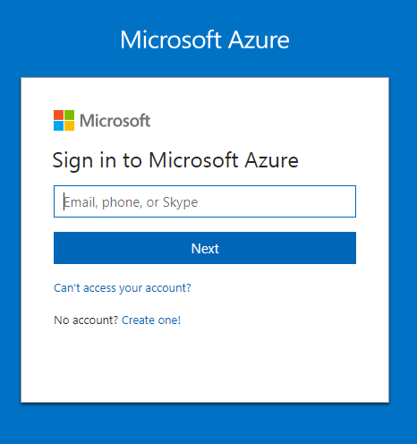

LogIn โดยใช้ Account ของ Microsoft เช่น Hotmail Outlook เมื่อทำการ LogIn เรียบร้อยแล้ว เราจะมาเจอหน้าจัดการ service ต่างที่อยู่ใน Microsoft Azure 

### สร้าง Subscriptions 

สร้าง Subscriptions โดย ไปที่ All services จะเจอรายการ services ต่างๆ

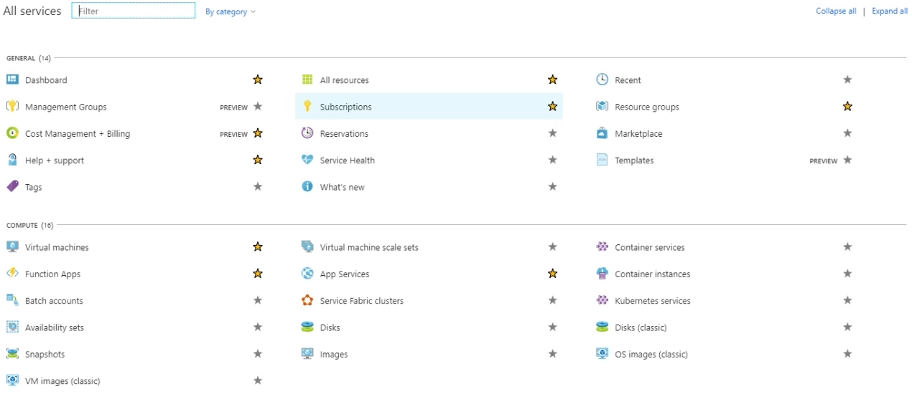

คลิ๊กที่ Subscriptions จะเจอหน้ารายการ subscriptions ที่เรามีอยู่ คลิ๊กที่ Add เพื่อสร้าง subscriptions ใหม่

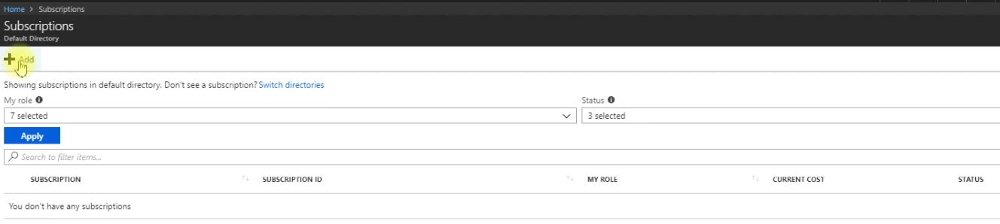

จะเจอหน้า Offer ต่างๆ ให้เลือก ในที่นี้จะเลือกแบบฟรี

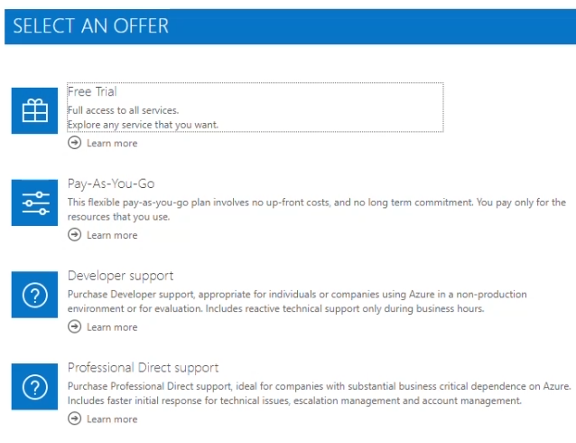

กรอกข้อมูลต่างๆ ให้ครบ (รวมถึงบัตรเครดิต หรือ บัตรเดบิต เพื่อยืนยันตัวตน)

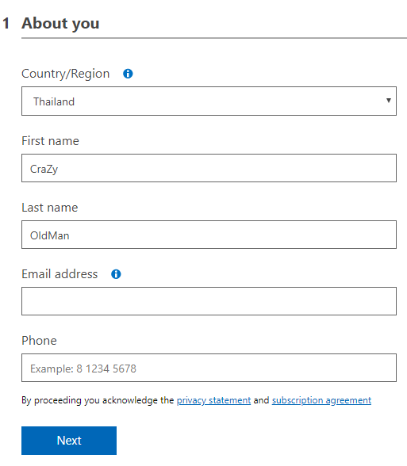

เมื่อกลับไปที่ เว็บ [portal.azure.com](https://portal.azure.com) จะพบว่ามี subscriptions ที่ชื่อว่า Free Trial ที่เราเพิ่งสร้างเพิ่มเข้ามา

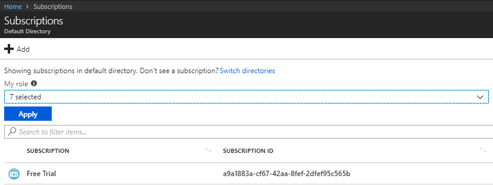

* * *

### สร้าง Azure Cosmos Data Base

เข้าไปที่ Azure Cosmos DB ที่อยู่ให้เมนูด้านซ้าย 

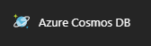

จะเจอหน้ารายการ Data Base ต่างๆที่เรามี

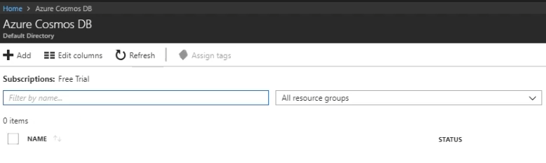

คลิ๊กที่ Create Azure Cosmos DB Account หรือ ปุ่ม +Add   
  
กรอกข้อมูลที่จะเอาไปใช้ทำให้ เว็บ หรือโปรแกรมต่างๆ สามารถเชื่อมต่อกับ DB ได้ 

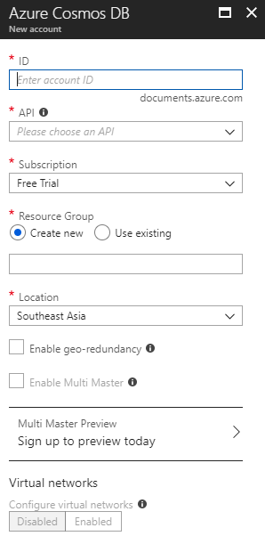

รอสักครู่ เพื่อให้ระบบดำเนินการสร้าง DB ให้กับเรา เมื่อระบบทำการสร้างเรียนร้อย จะพบว่าหน้ารายการมี DB ที่เราสร้างเพิ่มเข้ามา  

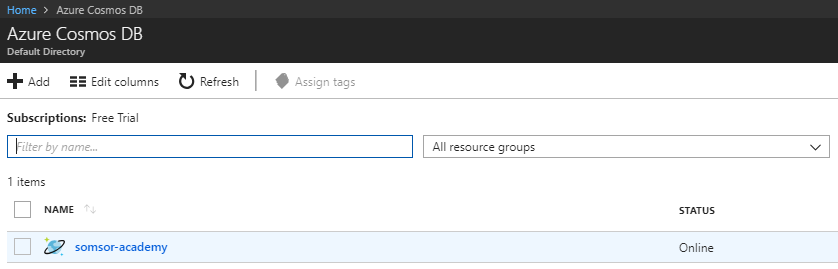

คลิ๊ก Add Collection เพื่อสร้างตาราง  

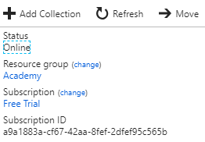  

ตั้งชื่อ DB และ Collection ID

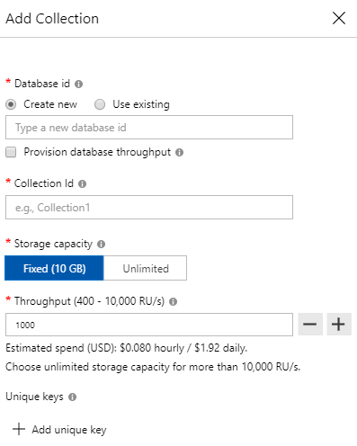

เมื่อเข้าไปที่เมนู Connection String ซ้ายมือ จะพบข้อมูลต่างๆ ของ DB สิ่งที่เราต้องการนำไปใช้เพื่อให้เว็บ หรือโปรแกรมต่างๆ สามารถเช้ื่อมต่อกับ DB ได้ก็คือ `PRIMARY CONNECTION STRING` ซึ่งสามารถ coppy ไปใช้ได้เลย

* * *
### VDO Link
