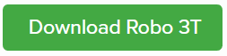
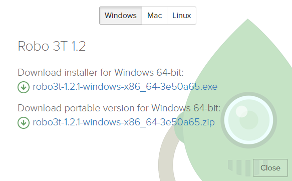
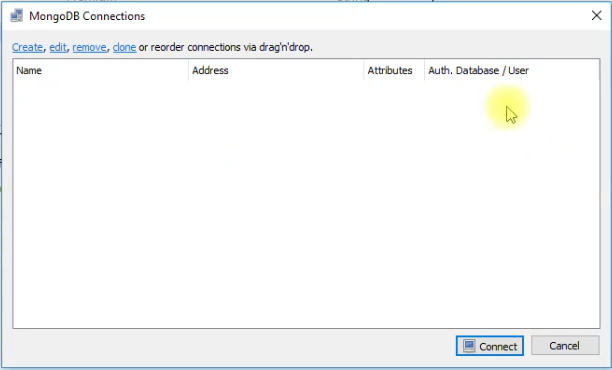
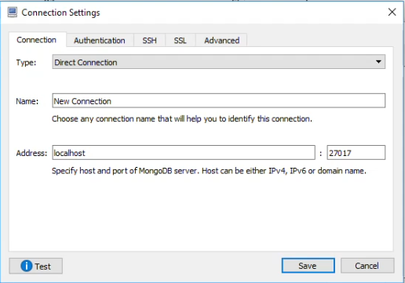
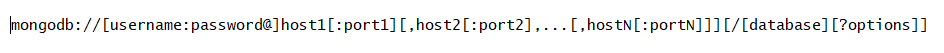
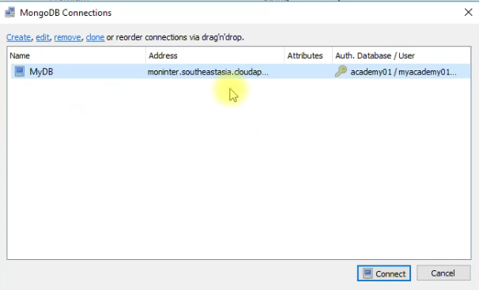
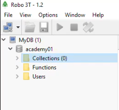
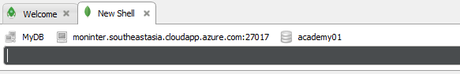
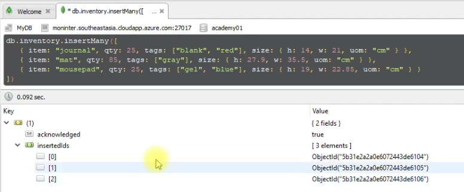

# EP 21-02 วิธีใช้ mongodb shell ผ่าน robomongo

robomongo คือ เครื่องมือที่ช่วยจัดการ DB ให้ง่ายขึ้น

### ดาวน์โหลด robomongo

เข้าไปที่เว็บ [robomongo.org](https://robomongo.org/) แล้วคลิ๊ก ดาวโหลด

เลือกไฟล์ที่จะดาวน์โหลดให้ตรงกับ os ที่ใช้

เมื่อดาวน์โหลดเรียบร้อยแล้ว ก็ทำการติดตั้ง

### เชื่อมต่อ robomongo กับ DB 

เมื่อติดตั้ง robomongo เรียนร้อยแล้ว เมื่อเปิดโปรแกรมขึ้นมาจะ โปรแกรมจะให้กรอกข้อมูลต่างๆ ก็กรอกให้เรียบร้อย  

ที่หน้าต่าง MongoDB Connections จะพบว่ายังไม่มี DB ที่ เชื่อมต่อแล้ว  

คลิ๊ก Create ด้านซ้ายบนของหน้าต่าง MongoDB Connections จะมีหน้าต่างให้กรอกข้อมูลต่างๆ 

  

ข้อมูลที่จะเอามาใส่นี้เราได้มาจาก Connection String ที่ได้มาจากการสร้าง Azure Cosmos Data Base ซึ่ง Connection String จะมีลักษณะเป็น Text ยาวๆ มีโครงสร้างดังรูป

สามารถอ่านข้อมูลเพิ่มเติมได้ที่ เว็บ [Robomongo](https://docs.mongodb.com/manual/reference/connection-string/)  

เมื่อกรอกข้อมูลเรียบร้อยแล้ว ในหน้า MongoDB Connections จะมี DB เพิ่มขึ้นมาให้เราทำงานต่างๆ ได้

เมื่อถึงขั้นตอนนี้ โปรแกรม robomongo จะเชื่อมต่อกับ DB ของเราแล้ว

### จัดการข้อมูลต่างๆ ใน DB โดยใช้ robomongo

เมื่อ robomongo เชื่อต่อกับ DB เรียบร้อยแล้ว จะเห็นว่า ในเมนูด้านซ้าย ยังไม่มีข้อมูลอะไรเลย

เราสามารถเพิ่มข้อมูลง่ายๆ โดยการคลิ๊กขวาที่ DB ที่ต้องการเพิ่มข้อมูลแล้วเลือก Open Shell จะมีแถบให้เราใส่ Code ที่เป็นข้อมูล  

เราสามารถดู Code ตัวอย่างได้ที่ [Robomongo](https://docs.mongodb.com/manual/crud/) เมื่อ code ข้อมูลเรียบร้อยแล้ว ให้กดปุ่ม Ctrl + Enter เพื่อ exque แล้วข้อมูลจะถูกเก็บเข้าไปใน DB 

* * * 
### VDO Link
